# 33 Concepts Every JavaScript Developer Should Know

> 깃허브 참고 https://github.com/leonardomso/33-js-concepts
>
> 영상 참고 https://www.youtube.com/watch?v=QkFkFqg-J04&list=PL7jH19IHhOLMmmjrwCi7-dMFVdoU0hhgF&index=10
>
> 번역본 참고 https://velog.io/@jakeseo_me/2019-04-30-1204-%EC%9E%91%EC%84%B1%EB%90%A8-fxjv37gc4s


## 1.Call Stack

> 자바스크립트가 함수를 핸들링하는 방법
>
> stack처럼 쌓이고, 후입선출
>
> JS의 ToDoList 느낌

```js
function three() {
    console.log("i love js");
}

function two() {
    three();
}

function one() {
    two();
}

function zero() {
    one();
}

zero();
```

- zero start - one start - two start - three start - "i love js" - three end - two end - one end - zero end


## 2. Primitive Types

> primitive : 기본적인

```js
function hello() {
    bye();
}

function bye() {
    hello();
}

hello();

# Maximum call stack exceeded
```

- string
  - 같은 '' "" 쌍
  - 문자열 안에 문자열 쓸땐 `\"`
- number
- boolean : true/false
- undefined : 정의되지 않음
- null : 존재하지 않음

```js
let hello;
console.log(hello);  // undefined

console.log(hello === undefined);  // true
console.log(hello === null);  // false

hello = null;
console.log(hello);  // null
```

- NaN : 수학 공식이 망함!
- typeof

```js
console.log(typeof true);  // "boolean"
```


## 3. Value Types and Reference Types

```js
let a = 50;
let b = a;  // a의 value를 copy해서 b에 paste

a = 10;
console.log(b);  // 50
```

```js
const a = ['element1', 'element2'];
const b = a;  // a와 b가 서로 동일한 배열을 참조

a.push('hELLO');
console.log(b);  // [ 'element1', 'element2', 'hELLO' ]
```

```js
console.log([10] === [10]);  // false, 메모리에 위치한 서로 다른 오브젝트
```

```js
const a = {
	x: 'hello',
}
const b = a;

b.x = 'lalala';
console.log(a);  // { x: 'lalala' }
```


## 4. Implicit, Explicit, Nominal, Structuring and Duck Typing

> Type Coercion (= Type Conversion)

```js
console.log(4 + "hello");  // 4hello

// js는 왼쪽에서 오른쪽 방향으로 읽음
console.log(4 + 4 + "hello");  // 8hello

// 별걸 다 바꿔줌 ㅇ0ㅇ
console.log(25-"1");  // 24

// boolean true는 숫자 1
console.log(1 == true);  // true
console.log(66 + true);  // 67

// 0, empty string, NaN, undefined, null은 false
// empty sting은 zero byte이고, js가 이를 0으로 변환시킴
console.log("" == true);  // false
console.log("" == false);  // true

// ==/!= 쓸 때만 type coercion이 작동
// ===/!== 쓸 때는 얄짤 ㄴ, 권장! 
console.log(1 == "1");  // true
console.log(1 === "1");  // false

// "true"는 변환이 안되고, true는 숫자 1로 변환되어 false
console.log("true" == true); // false
console.log("true" === true); // false
```


## 5. == vs === vs typeof

- typeof는 Primitive type에서 대부분 잘 작동

```js
console.log(typeof "hi");  // string 
console.log(typeof 13);  // number
console.log(typeof true);  // boolean
console.log(typeof undefined);  // undefined
console.log(typeof NaN);  // number
console.log(typeof null);  // object => 안고가는 bug
console.log(typeof []);  // object
```

- object인지 array인지 확인하고 싶을 땐? instaceof를 사용하면 됨,
- 다만 instanceof는 primitive type에서는 작동 ㄴ

```js
console.log([] instanceof Array);  // true
console.log({} instanceof Object);  // true
```


## 6. Function Scope, Block Scope and Lexical Scope

> scope 한줄 요약 : 너의 variable이 존재하는가, 하지 않는가?
>
> 큰 곳에서 작은 곳으로는 접근이 불가능하고, 작은 곳에서 큰 곳으로는 접근이 가능

- ##### global scope

```js
const h = "hello";

function a(){
    // 여기선 global scope인 h로 접근할 수 있지만,
    console.log(h);
    const b = "b";
}

a();  // hello
// 여기선 함수 a로 접근할 순 없어
console.log(b);  # error: Uncaught ReferenceError: b is not defined
```

```js
function a(){
	const b = "b";
	function c(){
		const d = "d";
		function e(){
			const nn = "nn";
		}
	}
}

// e는 b, d, nn접근 가능
// c는 b, d 접근 가능, nn 접근 불가
// a는 b 접근 가능, d, nn 접근 불가
```

```js
let hello;

if(true){
	hello = "hello";
}

console.log(hello);  // hello
```


## 7. Expression vs. Statement

- expression returns value
- statement 는 지시, 명령
  - if, else, else if , for, while etc

```js
function add(a, b){
    return a + b;
}
const how = add(5, 6);
console.log(how);  // 11
```


- ##### Function declaration
  
  - hoisting 
    - 모든  declaraion을 상단으로 가져옴.
    - 따라서, 아래와 같은 순서로 짜도 실행이 가능
    - 권장은 ㄴ 선언을 먼저 해주고 사용하기

```js
const awesome = add(1, 5)
function add(a, b){
    return a + b;
}
console.log(awesome);  // 6
```

- ##### Function expression

```js
const awesome = add(1, 5)
const add = (a, b) => a + b;
# error: Uncaught ReferenceError: Cannot access 'add' before initialization
# 이건 declaration아니고 expression!
console.log(awesome);
```

```js
const add = (a, b) => a + b;
const awesome = add(1, 5)
console.log(awesome);  // 6
```


## 8. IIFE, Modules and Namespaces

> 웹팩없는 자바스크립트 모듈

- ##### IIFE (Immediately-Invoked Function Expressions)

```js
const secretUsers = ["user1", "user2", "user3", "user4"];
console.log(secretUsers);  // ["user1", "user2", "user3", "user4"]

// 콘솔로 가서
secretUsers.push("yelin");
console.log(secretUsers);  // ["user1", "user2", "user3", "user4", "yelin"]
```

- 비밀로 만들고 싶을때,  IIFE => 실행은 되지만, 바꿀 순 없어!

```js
// 함수를 만들고, 호출
// 1
(function(){
    const secretUsers = ["user1", "user2", "user3", "user4"];
	console.log(secretUsers);  // ["user1", "user2", "user3", "user4"]
})()

// 2
(() => {
    const secretUsers = ["user1", "user2", "user3", "user4"];
	console.log(secretUsers);  // ["user1", "user2", "user3", "user4"]
})()

// 콘솔로 가서
console.log(secretUsers);
# error: Uncaught ReferenceError: secretUsers is not defined
```


- ##### Modules
  
  - import, export
  - 좋은 친구들이지만 브라우저에서는 import, export를 못함
  - script type="module" 로 해결~!

index.html

```html
<!DOCTYPE html>
<html>
  <head>
    <meta charset="utf-8">
    <meta name="viewport" content="width=device-width">
    <title>repl.it</title>
    <link href="style.css" rel="stylesheet" type="text/css" />
  </head>
  <body>
    <script src="script.js"></script>
    <script type="module" src="app.js"></script>
    <script type="module" src="app2.js"></script> 
  </body>
</html>
```

app.js

```js
let users = ['user1', 'user2', 'user3', 'user4'];

export const addUsers = (user) => (users = [...users, user]);

export const getUsers = () => users;

export const deleteUser = (user) => (users = users.filter(aUser => aUser !== user));
```

app2.js

```js
import { addUsers, getUsers } from './app.js';

console.log(getUsers());  // [ 'user1', 'user2', 'user3', 'user4' ]
addUsers("yelin");
console.log(getUsers());  // [ 'user1', 'user2', 'user3', 'user4', 'yelin' ]
```


## 9. Message Queue and Event Loop

> 파이썬은 블로킹언어, 자바스크립트는 논블로킹언어

- blocking 언어 => 한번에 두가지 일을 할 수 없음

- 예로 alert는 blocking function

```js
alert("hello");
console.log("hi");
// alert문을 닫기전에는 hi가 실행되지 않음.
```

```js
setTimeout(() => console.log("hi"), 0); // 인자는 기다려야하는 최소 시간임.
console.log("bye");

// bye
// hi
```

##### fetch도 아래 사진과 같음

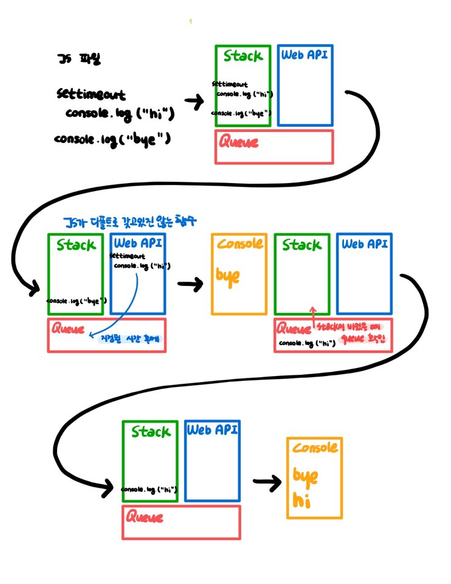


## 10. setTimeout, setInterval and requestAnimationFrame

> set Timeout은 js개념에서 온 아이가 아니고, 브라우저와 nodejs개념에서 옴

- ##### settimeout, setInterval

  - 시간이 지난 후에 기능을 메세지 큐에 붙여줌
  - stack이 비면 큐가 실행됨
  - 자바스크립트가 바쁘면 늦게 실행되고, 한가하면 빨리 실행되니까 시간이 정확하다고 볼 순 없음

```js
setTimeout(() => console.log("hi"), 1000);  // 1초뒤에 hi
```

```js
// 우리가 직접 함수를 호출하는 것이 아닌, setTimeout을 호출해서 setTimeout이 console.log를 호출하는 방식으로 사용하기
setTimeout(console.log, 1000, "hi");  // 1초뒤에 hi
```

```js
// 중간에 안하고 싶을때 clearTimeout! => timeout ID를 이용해서
const helloT = setTimeout(console.log, 1000, "hi"); 
console.log(helloT);  // 1  => timeout ID
clearTimeout(helloT);  // 이거 없으면 hi실행됨
```

```js
const helloT = setInterval(console.log, 1000, "hi");
console.log(helloT);
clearInterval(helloT);
```

- setTimeout은 정해진 초만큼 기다렸다가 함수를 실행
- setInterval은 정해진 초마다 함수를 실행
- 함수를 바로 실행하지 말고, 함수의 이름을 넣기
- 취소하고 싶다면 clear 사용 + 선언시 변수에 저장해서 ID를 저장할 수 있도록 하자
- Chrome에서는 interval이 1초보다 작으면 1초로 바꿔버림~!


##### requestAnimationFrame

- 이전에 스크린에서 무언가를 움직이게 하려면 setInterval를 사용했다, 5초마다 움직이기 등으로
- 이는 time specific이 아니기에 의지할 수 없고, cpu나 그래픽카드가 느리면 인터벌도 느려짐
- 그래서 나온게 requestAnimationFrame, 이는 브라우저를 렌더링하기 전에 함수를 실행
- 애니메이션 작업을 많이 하지 않는다면 안쓰겠지?
- 뭔가를 최대한 빠르게 실행하고 싶을때 사용해보기!


## 11. JavaScript Engines

> V8은 구글이 제공하는 강력한 오픈소스 자바스크립트 엔진이다. 자바스크립트 엔진이란 자바스크립트 코드를 마이크로프로세서가 이해할 수 있는 더 낮은 수준의 언어 혹은 기계어로 변환해주는 역할을 한다. Rhino, JavaScriptCore, SpiderMonkey와 같은 다양한 종류의 자바스크립트 엔진이 존재하며 자바스크립트는 ECMAScript 표준을 기반으로 하고, 엔진들은 ECMAScript 표준을 따른다. 


##### 크롬 V8엔진의 특성

- V8엔진은 C++로 작성됐고 Chrome과 Nodejs에서 사용

- V8엔진은 ECMA-262에 기재된 ECMAScript를 구현

- V8엔진은 standalone으로 동작할 수 있어서 우리는 자바스크립트 엔진을 C++ 프로그램에 내장시킬 수 있음
  - 예를 들면, `print('hello world')`는 Node.js에서 유효한 구문이 아니므로 컴파일하면 에러를 송출할 것이다. 하지만 우리는 깃허브에 오픈소스로 제공된 V8엔진의 맨 위에 프린트 문을 추가할 수 있다. 그래서 print함수가 native로 동작하게 만들 수 있다. 이러한 행위는 자바스크립트가 ECMAScript 표준이 정의하는 자바스크립트 동작보다 더 많은 동작을 하도록 허용해준다.

  - 이는 강력한 기능이다. C++은 자바스크립트에 비교했을 때, 더 많은 특성을 갖고있기 때문이다. C++은 하드 드라이브에 있는 파일과 폴더를 다룰 때 하드웨어와 훨씬 더 가까이 있다. 우리가 C++로 된 코드를 작성하도록 허용하고 자바스크립트에서 동작 가능하게 만드는 것이 가능하고 그래서 우리는 자바스크립트에 더 많은 특성을 추가할 수 있다.
  - Node.js 자체는 V8엔진, C++ 구현이고, C++로 구현된 V8엔진은 서버사이드 프로그래밍과 네트워킹 어플리케이션을 다룰 수 있게 해준다.
  - C++코드에서 `Print`와 `Read`와 같은 함수들의 구현을 볼 수 있습니다. 이 함수들은 Node.js에서 네이티브로는 불가능한 것들이다.


## 12. Bitwise Operators, Type Arrays and Array Buffers

> 비트연산자


```js
const myObject = {
  foo1: false,
  foo2: true,
  foo3: false,
  foo4: true
}

const HAS_FOO1 = 1;       // 0001
const HAS_FOO2 = 1 << 1;  // 0010
const HAS_FOO3 = 1 << 2;  // 0100
const HAS_FOO4 = 1 << 3;  // 1000

let myBitNumber = 0;

if (myObject['foo1'] === true)
  myBitNumber = myBitNumber | HAS_FOO1;
  // 합집합의 형태를 띄기 위해 bit연산자인 "|"를 사용합니다.

if (myObject['foo2'] === true)
  myBitNumber = myBitNumber | HAS_FOO2;

if (myObject['foo3'] === true)
  myBitNumber = myBitNumber | HAS_FOO3;

if (myObject['foo4'] === true)
  myBitNumber = myBitNumber | HAS_FOO4;

console.log(myBitNumber.toString(2));

if (myBitNumber & HAS_FOO1) {
  // False
}
if (myBitNumber & HAS_FOO2) {
  // True
}

if (myBitNumber & (HAS_FOO1 | HAS_FOO2)) {
  // True
}
if (myBitNumber & (HAS_FOO1 | HAS_FOO3)) {
  // False
}

if (myBitNumber == (HAS_FOO2 | HAS_FOO4)) {
  // True
}
if (myBitNumber == (HAS_FOO2 | HAS_FOO3 | HAS_FOO4)) {
  // False
}

console.log(HAS_FOO2 | HAS_FOO4)  // 10
console.log(myBitNumber | (HAS_FOO2 | HAS_FOO4))  // 10
if (myBitNumber == (myBitNumber | (HAS_FOO2 | HAS_FOO4))) {
  // True
}
console.log((HAS_FOO2 | HAS_FOO3 | HAS_FOO4))  // 14
console.log((myBitNumber | (HAS_FOO2 | HAS_FOO3 | HAS_FOO4)))  // 14
if (myBitNumber == (myBitNumber | (HAS_FOO2 | HAS_FOO3 | HAS_FOO4))) {
  // False
}
```


## 13. DOM and Layout Trees

##### DOM?

- 웹사이트는 HTML Document라는 것을 포함한다. 웹사이트를 보기 위해 사용하는 브라우저는 HTML과 CSS를 해석하는 프로그램이다. 그리고 style, content, structure 등을 우리가 보는 페이지에 렌더링한다.
- HTML과 CSS의 structure와 style을 파싱하기 위해서, 브라우저는 Document Object Model이라 불리는 document의 겉모양(representation)을 만든다. 이 **모델(model)** 은 자바스크립트가 오브젝트로서의 웹사이트 document의 컨텐트와 엘리먼트에 접근할 수 있도록 해준다.


##### Document 객체(Document Object)

- `document` 객체는 우리가 웹사이트에 접근하고 수정할 수 있는 많은 **프로퍼티(properties)** 와 **메소드(methods)** 를 가진 빌트인 오브젝트이다. DOM을 어떻게 작업해야 하는지 이해하기 위해, 자바스크립트에서 오브젝트가 어떻게 동작하는지 이해하는 것이 필수적이다.

- *Console*창에서 `document`라고 타이핑하신 뒤에 엔터를 치면, Elements 탭에서 보던 것과 같은 내용을 결과로 보게 된다.

```js
> document;
```

```js
// Output
// #document
<!DOCTYPE html>
<html lang="en">

  <head>
    <title>Learning the DOM</title>
  </head>

  <body>
    <h1>Document Object Model</h1>
  </body>

</html>
```


##### DOM과 HTML 소스 코드의 차이점은 무엇일까?

- DOM은 자바스크립트 클라이언트 사이드에 의해 수정된다.
- 브라우저는 소스코드에 존재하는 에러를 자동으로 고친다.

```js
> document.body
```

```js
// Output
<body>
  <h1>Document Object Model</h1>
</body>
```

`document`는 오브젝트입니다. `body`는 '.'으로 접근할 수 있는 `document`의 프로퍼티로 `document.body`를 콘솔에 작성하는 것은 `body` 엘리먼트와 그 안에 있는 모든 것들을 출력한다. 콘솔에서, 이 웹페이지의 `body` 오브젝트의 라이브 프로퍼티의 일부를 수정할 수 있다. 배경색을 `fuchsia`로 바꿔보자.

*Element* 탭으로 이동해서 `document.body`를 다시 콘솔에 타이핑해보세요. DOM이 변경된 것을 보실 수 있을 겁니다.

```js
// Output
<body style="background-color: fuchsia;">
  <h1>Document Object Model</h1>
</body>
```

우리가 타이핑했던 `body`의 배경색을 `fuchsia`로 할당했던 자바스크립트 코드는 이젠 DOM의 일부이다.

하지만, 웹사이트의 소스는 우리가 자바스크립트를 통해 추가했던 새로운 스타일 속성을 갖고 있지 않다. 웹사이트의 소스는 변하지 않고, 페이지를 새로고침하면, 우리가 콘솔에 추가했던 새로운 코드는 사라집니다.

DOM이 HTML 소스코드와 다른 출력결과를 갖는 또 하나의 사례는 소스코드에 에러가 있을 때이다. 하나의 공통적인 예시를 들자면 `table` 태그에는 안에 `tbody` 태그가 요구됩니다. 하지만 개발자들은 HTML 소스 내부에 좀처럼 잘 추가하지 않는다. 브라우저는 자동적으로 에러를 찾아주고 DOM을 수정하여 `tbody` 코드를 추가해준다. DOM은 제대로 닫히지 않은 태그에 대해서도 수정해준다.


## 14. Factories and Classes

##### 생성자 함수

```js
function Vehicle(make, model, color) {
  this.make = make,
  this.model = model,
  this.color = color,
  this.getName = function () {
    return this.make + " " + this.model;
  }
}
```

```js
let car = new Vehicle("Toyota", "Corolla", "Black");
let car2 = new Vehicle("Honda", "Civic", "White");
```

이 기술에는 몇가지 문제점이 있다. 우리가 `new Vehicle()`이라는 코드를 작성할 때, 자바스크립트 엔진이 실제로 하는 일은 우리의 각 오브젝트에 대해서 `Vehicle` 생성자 함수를 복사하는 일이다. 각각 그리고 모든 프로퍼티 그리고 메소드가 `Vehicle`의 새로운 인스턴스에 복사된다. 그래서 이게 무슨 문제가 있냐고요?

문제는 바로 우리는 우리 생성자 함수의 멤버 함수가 모든 오브젝트에서 반복되는 것을 원하지 않는다는 점이다. 이건 중복된 코드를 계속 생성한다. 또 다른 문제는 우리가 새로운 프로퍼티나 메소드를 존재하는 생성자 함수(constructor function)에 추가할 수 없다는 점이다.

```js
car2.year = "2012" // ('존재하는 오브젝트에는 가능하지만 생성자 함수에는 추가할 수 없다')
```

year 프로퍼티를 추가하려면 생성자 함수 자체에 추가해야 한다.

```js
function Vehicle(make, model, color, year) {
        this.make = make,
        this.model = model,
        this.color = color,
        this.year = year,
        this.getName = function () {
            return this.make + " " + this.model;
        }
}
```


##### 프로토타입

자바스크립트에서 새로운 함수가 만들어질때마다, 자바스크립트 엔진은 기본으로 `prototype` 프로퍼티를 추가한다. 이 프로토타입은 우리가 "프로토타입 오브젝트(prototype object)"라고 부르는 것이다. 기본으로 이 프로토타입 오브젝트는 우리 함수를 다시 가리키는 생성자 프로퍼티와 오브젝트인 또 다른 프로퍼티 `__proto__`를 갖고 있다.


`__proto__` 프로퍼티는 'dunder proto'라고 불리고 이 프로퍼티는 우리의 생성자 함수의 프로퍼티를 가리킨다.

생성자 함수의 새로운 인스턴스가 생성될 때마다, 다른 프로퍼티와 메소드와 함께 이 프로퍼티(**proto**)도 인스턴스에 복사된다.

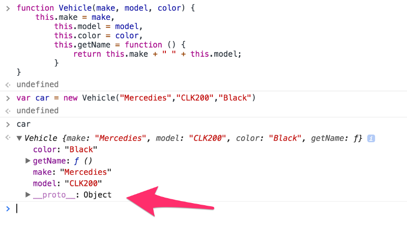

이 프로퍼티 오브젝트는 생성자 함수에 새로운 프로퍼티와 메소드를 추가하기 위해 사용될 수 있다. 다음 문법을 사용하면 모든 생성자 함수 인스턴스에서 사용 가능할 것이다.

```js
car.__proto__.year = "2016"; // 원문은 car.prototype.year = "2016" 이었으나 현재는 동작하지 않는 코드
```

프로토타입은 멋집니다 하지만 프로토타입 접근법을 사용하는동안 몇가지 유의해야할 점이 있다. 프로토타입 프로퍼티와 메소드는 모든 생성자 함수 인스턴스 간에 공유가 되지만 생성자 함수의 인스턴스 중 하나에서 어떤 프리미티브 프로퍼티를 변경하였을 때는, 해당 인스턴스에만 반영이 되고, 다른 인스턴스들 사이에서는 반영이 안된다는 것이다.

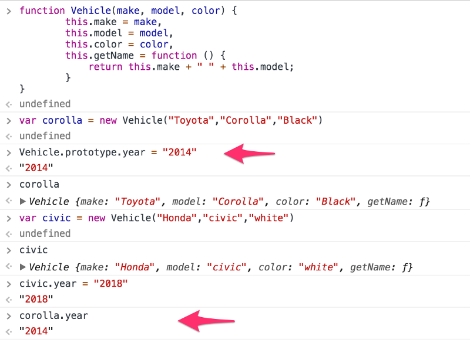

또 하나 알아둬야 할 것은, 참조 타입 프로퍼티는 항상 모든 인스턴스 사이에서 공유된다는 것이다. 예를 들면, 배열 타입의 프로퍼티의 경우, 만일 생성자 함수의 한 인스턴스에 의해 수정되었다면, 모든 인스턴스에 대해 수정된다.

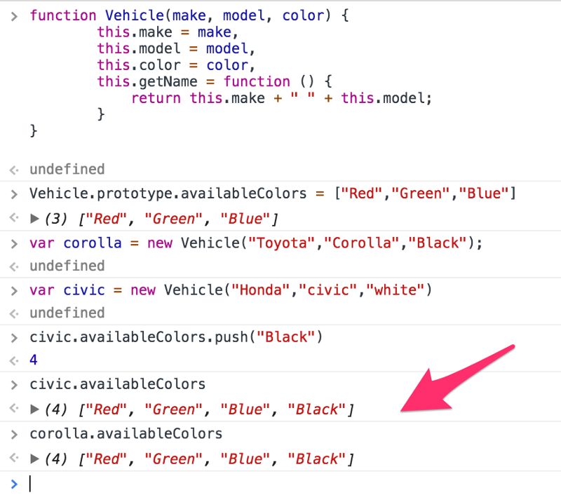


##### 클래스

```js
class Vehicle {
    constructor(make, model, color) {
        this.make = make;
        this.model = model;
        this.color = color;
    }

    getName() {
        return this.make + " " + this.model;
    }
}
```

```js
let car = new Vehicle("Toyota", "Corolla", "Black");
```

위의 코드를 작성함으로써, 우리는 `Vehicle`이라는 이름을 가진 변수를 만들었다. 이 변수는 클래스에 정의된 생성자 함수를 참조한다. 또한 우리는 `Vehicle` 변수의 프로토타입에 메소드도 추가했다.

```js
function Vehicle(make, model, color) {
    this.make = make;
    this.model = model;
    this.color = color;
}

Vehicle.prototype.getName = function () {
    return this.make + " " + this.model;
}

let car = new Vehicle("Toyota", "Corolla", "Black");
```

우리가 배운 내용이 증명하는 것은, 클래스는 그저 생성자 함수를 작성하는 새로운 방법이다. 하지만 진짜 클래스처럼 만들기 위해서 새로 소개된 몇가지 것들과 규칙들이 더 있다.

1) 클래스에서는 `constructor`를 작동시키기 위해 `new` 키워드가 필요하다. 이것이 의미하는 것은 생성자는 우리가 다음과 같이 코드를 작성했을 때만 호출시킬 수 있다는 것이다.

```js
let car = new Vehicle("Toyota", "Corolla", "Black");
```


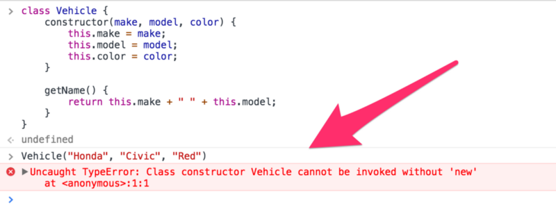

2) 클래스 메소드는 enumerable하지 않다. 자바스크립트에서, 오브젝트의 각 프로퍼티는 `enumerable` 플래그를 갖고 있다. 이 플래그는 그 프로퍼티에서 어떤 명령이 실행되는지 유효성을 정의한다. 클래스는 `prototype`에 정의된 모든 메소들에 대해 이 플래그를 `false`로 설정한다.

3) `constructor`를 클래스에 추가하지 않는다면, 기본 값으로 빈 `constructor`가 자동으로 추가된다.

```js
constructor() {}
```

4) 클래스 내부의 코드는 항상 `strict` 모드다. 이러한 점은 코드를 작성하는 도중 에러를 날림으로써, 오타 또는 문법적인 에러가 없는 코드를 작성하는 것을 돕는다. 실수로 어딘가에서 참조되는 코드를 지웠을 때도 알아채기 쉽다.

5) 클래스 선언은 `hoisted`되지 않는다. 자바스크립트에서 호이스팅은 모든 선언문들이 자동적으로 현재 스코프의 가장 위로 올라가는 것이다. 호이스팅은 변수나 함수가 실제로 선언되기 전에 쓰이게 만들어 버그와 의도치 않은 동작을 유발한다.

호이스팅의 예는 다음과 같다.

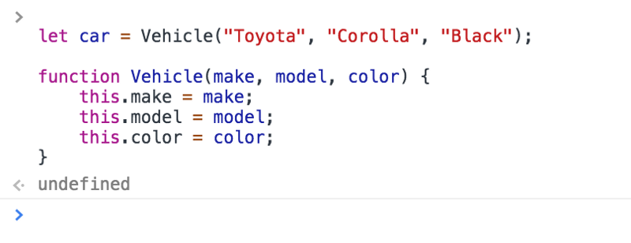

이 코드는 동작한다.

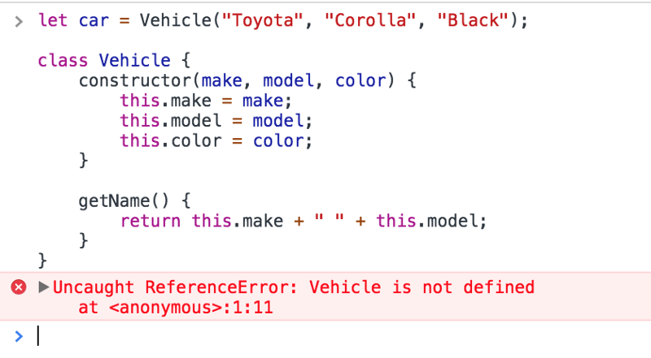

이 코드는 동작하지 않는다.

6) 클래스는 오브젝트 리터럴이나 생성자 함수 같은 것을 프로퍼티의 값으로 할당하는 것을 허락하지 않습니다. 함수나 getters/setters 같은 것만 가질 수 있습니다. 그러니 클래스에서 `property:value` 할당을 바로 하지마세요.


##### 클래스 특성

1) 생성자

클래스 선언에서, 생성자는 특별한 함수, 생성자는 클래스 자체를 표현하는 함수를 정의

```js
let car = new Vehicle("Honda", "Accord", "Purple");
```

생성자는 클래스의 생성자를 확장된 형태로 부르기 위해 `super` 키워드를 사용


2) 정적 메소드

정적 메소드는 프로토타입 위에 있는 것이 아닌 클래스 자체에 있는 함수

`prototype`에서 정의된 메소드들은 정적 메소드와 다릅니다.

정적 메소드들은 `static` 키워드를 사용하여 선언

정적 메소드의 대부분은 공용 함수(utility functions)를 만들기 위해 사용

정적 메소드들은 클래스의 인스턴스를 생성하지 않고 호출

```js
class Vehicle {
    constructor(make, model, color) {
        this.make = make;
        this.model = model;
        this.color = color;
    }

    getName() {
        return this.make + " " + this.model;
    }

    static getColor(v) {
        return v.color;
    }
}

let car = new Vehicle("Honda", "Accord", "Purple");

Vehicle.getColor(car); // "purple"
```

기억하셔야 할 점은, 정적 메소드는 클래스 인스턴스에서 호출할 수 없다는 점


3) Getters/Setters

클래스는 또 프로퍼티의 값을 가져오거나/프로퍼티의 값을 설정하기 위해 getters/setters를 가질 수 있습니다. 예제는 아래와 같습니다.

```js
class Vehicle {
    constructor(model) {
        this.model = model;
    }
    
    get model() {
        return this._model;
    }

    set model(value) {
        this._model = value;
    }
}
```

내부에서(under the hood), getters/setters는 클래스 `prototype`에 정의


4) Subclassing

Subclassing은 자바 클래스에서 상속을 구현할 수 있는 방법입니다. `extends`라는 키워드는 클래스의 자식 클래스를 만들 때 사용

```js
class Vehicle {
    constructor(make, model, color) {
        this.make = make;
        this.model = model;
        this.color = color;
    }

    getName() {
        return this.make + " " + this.model;
    }
}

class Car extends Vehicle{
    getName(){
        return this.make + " " + this.model +" in child class.";
    }
}

let car = new Car("Honda", "Accord", "Purple");

car.getName(); // "Honda Accord in child class."
```

위 소스에서 `getName()` 함수를 불러올 때, 자식 클래스에서 불러진 것을 볼 수 있다.

때때로 우리는 베이스 클래스의 함수를 불러올 필요가 있을 때가 있다. 우린 자식 클래스의 메소드 내에서 베이스 클래스의 메소드를 호출하기 위해 `super` 키워드를 사용한다.

```js
class Car extends Vehicle{
    getName(){
        return super.getName() + " - called base class function from child class.";
    }
}
```

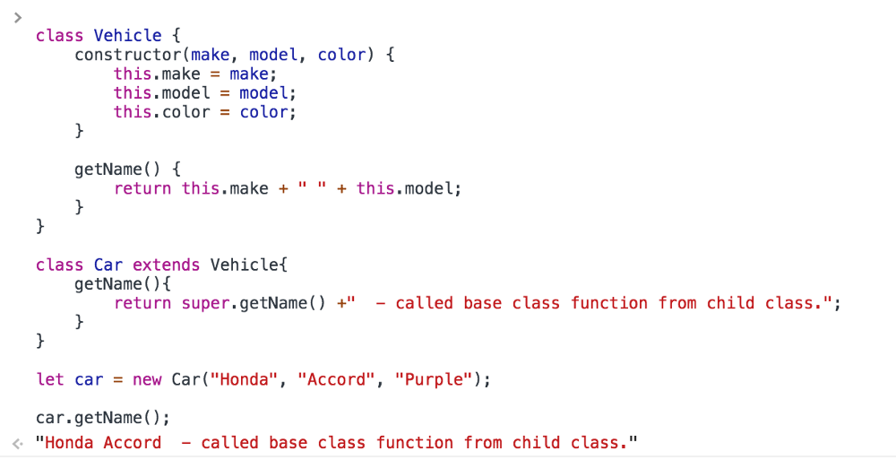


## 15. this, call, apply and bind

### 자바스크립트에서 "This" 이해하기

#### "this"의 개념적 개요 

> 함수가 만들어졌을 때, 뒤에서는 `this`라 불리는 키워드가 만들어진다. `this`는 함수가 동작하는 곳에 있는 오브젝트와 연결해준다. `this` 키워드의 값은 그 함수 자체와는 상관이 없다. 함수가 어떻게 불려지는지가 `this`의 값을 결정한다.


#### 기본 "this" 컨텍스트

```js
// define a function
var myFunction = function () {
  console.log(this);
};

// call it
myFunction();
```

`this`의 값은 어떤 것이 될지 예측할 수 있을까? 기본 값으로, `this`는 언제나 전역 스코프의 root을 참조하는 window Object가 된다. 만일, 스크립트가 strict mode(`"use strict"`) 내에서 작동하고 있다면, `this`는 undefined일 것이다.


#### 오브젝트 리터럴(Object literals)

```js
var myObject = {
  myMethod: function () {
    console.log(this);
  }
};
```

여기서 `this`의 값으론 무엇이 들어올까?

- this === myObject?
- this === window?
- this === anything else?

정답은 **우린 모른다**.

기억해두세요. **this** 키워드의 값은 언제나 함수 그 자체와는 상관 없다. 함수가 어떻게 호출되는지가 `this`의 값을 결정한다.

코드를 조금만 바꿔보자.

```js
var myMethod = function () {
  console.log(this);
};

var myObject = {
  myMethod: myMethod
};
```

물론, 여전히 `this`의 값은 우리가 함수를 어떻게 호출하냐에 따라 달렸다.

코드 안의 `myObject`는 `myMethod`라 불리는 프로퍼티를 갖는다. 이 프로퍼티는 `myMethod` 함수를 가리킨다. `myMethod` 함수가 글로벌 스코프로부터 호출됐을 때, `this`는 window object를 참조한다. `myObject`의 메소드로서 호출됐을 때는, `this`가 `myObject`를 참조한다.

```js
myObject.myMethod() // this === myObject
myMethod() // this === window
```

이러한 형식은 **묵시적 바인딩(implicit binding)** 이라 불린다.


#### 명시적 바인딩(Explicit binding)

함수에 명시적으로 컨텍스트를 바인딩할 때, 그것을 명시적 바인딩이라 한다. 이러한 동작은 주로 `call()` 메소드와 `apply()` 메소드에 의해 이뤄진다.

```js
var myMethod = function () {
  console.log(this);
};

var myObject = {
  myMethod: myMethod
};

myMethod() // this === window
myMethod.call(myObject) // this === myObject => { myMethod: [Function] }
myMethod.apply(myObject) // this === myObject => { myMethod: [Function] }
```

명시적 바인딩과 묵시적 바인딩 중에 어느 쪽이 더 우선순위를 가질까?

```js
var myMethod = function () {
  console.log(this);
};

var obj1 = {
  a: 2,
  myMethod: myMethod
};

var obj2 = {
  a: 3,
  myMethod: myMethod
};

obj1.myMethod(); // { a: 2, myMethod: [Function] }
obj2.myMethod(); // { a: 3, myMethod: [Function] }

obj1.myMethod.call( obj2 ); // { a: 3, myMethod: [Function] }
obj2.myMethod.call( obj1 ); // { a: 2, myMethod: [Function] }
```

명시적인 바인딩은 묵시적 바인딩보다 우위를 갖게 된다.


#### 하드 바인딩(Hard binding)

하드 바인딩은 `bind()` (ES5)으로 가능하다. `bind()` 메소드는 우리가 지정한 `this` 컨텍스트를 가진 기존 함수를 불러오기 위해 하드코딩된 새로운 함수를 반환한다.

```js
myMethod = myMethod.bind(myObject);

myMethod(); // this === myObject
```

하드바인딩은 명시적 바인딩보다 우위를 갖게 된다.

```js
var myMethod = function () {
  console.log(this);
};

var obj1 = {
  a: 2
};

var obj2 = {
  a: 3
};

myMethod = myMethod.bind(obj1); // 2
myMethod.call( obj2 ); // 2 명시적 바인딩은 obj2이나, obj1로 하드바인딩 되어있음
```


#### 'New' 바인딩(New binding)

```js
function foo(a) {
  this.a = a;
}

var bar = new foo( 2 );
console.log( bar.a ); // 2
```

새로운 new 인스턴스를 참조하는 함수가 호출되었을 때, `this`가 만들어진다.

함수가 new와 함께 호출되었을 때는 묵시적, 명시적 또는 하드 바인딩을 신경쓰지 않는다. 이 때는 그냥 새로운 인스턴스인 새로운 컨텍스트를 만들어낸다.

```js
function foo(something) {
  this.a = something;
}

var obj1 = {};

var bar = foo.bind( obj1 );
bar( 2 );
console.log( obj1.a ); // 2

var baz = new bar( 3 );
console.log( obj1.a ); // 2
console.log( baz.a ); // 3
```

> 역자 주: 위에서 bar 변수를 obj1로 바인딩 하였고, new 키워드 없이는 바인딩된대로 잘 동작하였으나, new 키워드가 붙은 이후에는 새로운 컨텍스트를 만들었다.


#### API 호출

때때로, 우리는 라이브러리나 헬퍼오브젝트를 사용합니다. (Ajax, event handling, etc.) 그리고 전달된 콜백을 호출합니다. 이러한 경우에는, this의 동작을 주의해야 한다.

```js
myObject = {
  myMethod: function () {
    helperObject.doSomethingCool('superCool', this.onSomethingCoolDone);
    },

    onSomethingCoolDone: function () {
      /// Only god knows what is "this" here
    }
};
```

코드를 보세요. 우리가 "this.onSomethingCoolDone"을 콜백으로 넘겼기 때문에, 스코프가 그 메소드를 참조하고 있다고 생각할 수도 있다.

이 부분을 고치기 위해, 몇가지 방법이 있다.

- 주로 라이브러리들은 우리를 위해 또 다른 파라미터를 제공한다. 우리는 그곳에 우리가 다시 가져오길 원하는 스코프를 전달할 수 있다.

```js
myObject = {
  myMethod: function () {
    helperObject.doSomethingCool('superCool', this.onSomethingCoolDone, this);
  },

  onSomethingCoolDone: function () {
    /// Now everybody know that "this" === myObject
  }
};
```

- 원하는 스코프를 하드 바인드 할 수도 있다.

```js
myObject = {
  myMethod: function () {
    helperObject.doSomethingCool('superCool', this.onSomethingCoolDone.bind(this));
  },

  onSomethingCoolDone: function () {
    /// Now everybody know that "this" === myObject
  }
};
```

- 클로져를 만들고 `this`를 `me`에 캐시할 수도 있다.

```js
myObject = {
  myMethod: function () {
    var me = this;

    helperObject.doSomethingCool('superCool', function () {
      /// Only god knows what is "this" here, but we have access to "me"
    });
  }
};
```

이 방법은 추천드리지 않습니다. 왜냐하면 메모리 누수를 초래할 수 있고, 진짜 스코프를 잊게 만들고 변수에 의존하게 만들기 때문이다. 스코프가 정말 엉망이 되는 지경에 다다를 수도 있다.

This 문제는 이벤트 리스너, 타임아웃, forEach와 같은 것들에도 적용된다.


### call(), apply(), bind() 이해하기

이 포스트에서 우리는 간단한 자바스크립트 코드 예제를 통해, `call()`, `apply()`, `bind()` 메소드의 차이에 대해 알아볼 것이다. 자바스크립트에서 함수들은 오브젝트들이고, 위 3개의 메소드는 함수의 호출을 제어하기 위해 사용된다. `call()`과 `apply()`는 ECMAScript 3에서 소개되었고, `bind()` 메소드는 ECMAScript 5에서 추가되었다.


#### 용례

함수를 즉시 호출하기 위해서 `call()` / `apply()` 메소드를 사용할 수 있다. `bind()` 는 함수가 나중에 실행됐을 때도 원본 함수를 호출할 때 갖는 올바른(correct) 컨텍스트(**this**)가 bind된 함수를 반환한다. 그래서 `bind()`는 특정 이벤트에서 함수가 나중에 호출될 필요가 있을 때, 유용하다.


#### `call()` 또는 `Function.prototype.call()`

```js
//Demo with javascript .call()

var obj = {name:"Niladri"};

var greeting = function(a,b,c){
    return "welcome "+this.name+" to "+a+" "+b+" in "+c;
};

console.log(greeting.call(obj,"Newtown","KOLKATA","WB"));
// returns output as welcome Niladri to Newtown KOLKATA in WB
```

`call()` 메소드의 첫번째 파라미터는 함수가 호출되는 순간 **"this"** 오브젝트 값을 세팅한다. 이 경우에는 **"obj"** 가 this 오브젝트고, 나머지 파라미터들은 실제 함수의 인자들이다.


#### `apply()` 또는 `Function.prototype.apply()`

```js
//Demo with javascript .apply()

var obj = {name:"Niladri"};

var greeting = function(a,b,c){
    return "welcome "+this.name+" to "+a+" "+b+" in "+c;
};

// array of arguments to the actual function
var args = ["Newtown","KOLKATA","WB"];  
console.log("Output using .apply() below ")
console.log(greeting.apply(obj,args));

/* The output will be 
  Output using .apply() below
 welcome Niladri to Newtown KOLKATA in WB */
```

`call()` 메소드와 비슷하게 동작합니다. 첫번째 파라미터는 함수가 호출되는 순간 **"this"** 의 값을 세팅한다. 위의 경우에는 **"obj"** 오브젝트고, `apply()` 메소드가 `call()` 메소드와 유일하게 다른 점은 두번째 파라미터에서 실제 함수의 인자 값을 **배열**로 받는다는 것이다.

##### 

#### `bind()` 또는 `Function.prototype.bind()`

```js
//Use .bind() javascript

var obj = {name:"Niladri"};

var greeting = function(a,b,c){
    return "welcome "+this.name+" to "+a+" "+b+" in "+c;
};

//creates a bound function that has same body and parameters 
var bound = greeting.bind(obj); 


console.dir(bound); ///returns a function

console.log("Output using .bind() below ");

console.log(bound("Newtown","KOLKATA","WB")); //call the bound function

/* the output will be 
Output using .bind() below
welcome Niladri to Newtown KOLKATA in WB */
```

`bind()` 메소드에 대한 위의 코드예제에서 우리는 context를 가진 나중에 호출될 bound 함수를 반환한다. 우리는 bound 함수가 콘솔에서 다음과 같이 정의된 것을 볼 수 있다.


bind() 메소드에 대한 첫번째 파라미터는 역시 bound 함수가 호출될 때, 타겟 함수에서 **"this"** 의 값을 세팅하는 부분이다. bound 함수가 **"new"** 연산자를 이용하여 생성됐을때는, 바인드 시킨 this 값(첫번째 파라미터의 값)이 무시된다는 것을 알아야 한다. 나머지 파라미터들은 인자로 잘 넘겨진다.


## 16. new, Constructor, instanceof and Instances

### 4가지 규칙

`new`를 사용할 때, 다음 4가지 일이 벌어진다.

1. 새로운 빈 오브젝트를 생성
2. `this`를 새롭게 생성된 오브젝트에 바인드
3. 새롭게 생성된 오브젝트의 프로퍼티에 "**proto**" 라고 불리는 생성자 함수의 프로토타입 오브젝트를 추가
4. 함수에서 완성된 오브젝트가 반환될 수 있도록, `return this`를 함수의 맨 마지막 부분에 추가


### 잠깐만요. 뭐라구요?

```js
function Student(name, age) {
  this.name = name;
  this.age = age;
}
```

```js
var first = new Student('John', 26);
```

위 코드를 실행시켰을 때, 무슨 일이 일어났을까요?

1. 새로운 오브젝트가 생성 - `first` 오브젝트가 생성
2. `this`가 우리의 `first` 오브젝트에 바운딩 - `this`를 참조하면 `first` 오브젝트가 참조된다.
3. **proto**가 추가 -  `first.__proto__`는 이제 `Student.prototype`을 가리킨다.
4. 모든 것이 끝난 뒤에, 새로운 `first` 오브젝트가 리턴되어 `first` 변수에 할당된다.

이제 우리는 이 과정이 제대로 작동하는지 테스트하기 위해, 몇가지 간단한 `console.log`를 실행시킬 수 있습니다.

```js
console.log(first.name);
// John
console.log(first.age);
// 26
```


### 프로토타입(Prototypes)

모든 자바스크립트 오브젝트는 프로토타입을 가지고 있다. 자바스크립트의 모든 오브젝트는 프로토타입에서 메소드를 상속받고 프로퍼티를 상속받는다.

```js
function Student(name, age) {
  this.name = name;
  this.age = age;
}
```

```js
Student.prototype;
// Object {...}
```

```js
var second = new Student('Jeff', 50);
```

```js
Student.prototype.constructor;
//  function Student(name, age) {
//    this.name = name;
//    this.age = age;
//  }
```

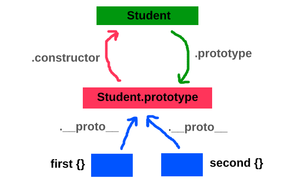

> 정말 아름답죠?

위에서 볼 수 있듯이, 우리의 `Student` 생성자 함수는 (모든 생성자 함수들도 마찬가지) `.prototype`이라 불리는 프로퍼티를 가진다. 이 프로토타입은 프로퍼티에 `.constructor`라 불리는 오브젝트를 가지고 있다. 이 오브젝트는 생성자 함수를 다시 가리킨다. 훌륭한 자그마한 루프이다. 후에 우리가 `new` 연산자를 이용하여 새로운 오브젝트를 만들 때, 각각의 오브젝트는 `.__proto__` 프로퍼티를 갖는다. `__proto__` 프로퍼티는 새로운 오브젝트를 다시 `Student.prototype` 으로 연결해준다.

그래서 이게 왜 중요할까?

> **상속 때문에 중요하다. 프로토타입 오브젝트는 그 생성자 함수로 만들어진 모든 오브젝트에서 공유된다. 이 말은 우리가 함수나 프로퍼티를 프로토타입에 추가하면 모든 오브젝트가 그것들을 이용할 수 있다는 말이다.**

```js
Student.prototype.sayInfo = function(){
  console.log(this.name + ' is ' + this.age + ' years old');
}
```

다시 설명하자면, 우리가 지금 입력한 것은 Student 프로토타입에 함수를 추가한 것이다. 우리가 생성한 student 오브젝트나 이미 생성된 student 오브젝트 모두 새로운 메소드인 `.sayInfo`에 접근할 수 있다. 

```js
second.sayInfo();
// Jeff is 50 years old
```

```js
var third = new Student('Tracy', 15);
// Now if we log third out, we see the object only has two
// properties, age and name. Yet, we still have access to the 
// sayInfo function:
third;
// Student {name: "Tracy", age: 15}
third.sayInfo();
// Tracy is 15 years old
```

잘 작동하는 이유는 *상속(inheritance)* 때문이다. 자바스크립트 오브젝트는 처음에 우리가 호출하는 프로퍼티가 있는지부터 검사할 것이다. 만일 우리가 호출하는 프로퍼티가 없다면, 상위로 올라간다. 상위에는 프로토타입이 있고 자바스크립트 엔진은 *"헤이! 너 이 프로퍼티 있니?* 라고 물어볼 것이다. 이 패턴은 그 프로퍼티를 찾을 때까지 계속된다. 다만 전역 오브젝트에서 프로토타입 체인은 끝나게 된다.

상속은 과거에 `.toString()`과 같은 메소드를 사용할 수 있었던 것과 같은 원리다. 우리는 `.toString()` 메소드를 전혀 코딩한적이 없다. 하지만 잘 써왔다. 그 이유는 다른 자바스크립트 메소드가 `Object prototype`에 이미 작성되어 있기 때문이다. 우리가 만드는 모든 오브젝트는 궁극적으로 `Object prototype`를 상속받게 되어 있다. 그리고 우리는 이러한 메소드를 오버라이딩 할 수도 있다.

```js
var name = {
  toString: function(){
    console.log('Not a good idea');
  }
};
name.toString();
// Not a good idea
```

우리의 오브젝트는 처음에 프로토타입으로 이동하기 전에 오브젝트 내부에 메소드가 있는지 먼저 확인한다. 우리 오브젝트가 메소드를 갖고 있기 때문에, 상속이 일어나지 않고 우리 오브젝트가 가진 메소드가 작동한다. 하지만 이건 좋은 아이디어는 아니다. 글로벌 메소드를 그냥 내버려 두자. 메소드의 이름을 지을 때는 글로벌 메소드의 이름을 피하자.


## 17. Prototype Inheritance and Prototype Chain

### 'class' 키워드가 존재하기 전

우리가 자바스크립트에서 *'classes'* 를 구현하는 예제다. 이렇게 구현하던 시절도 사실 그렇게 오래전은 아니다. 첫번째 함수는 **constructor** 이다. Cat 클래스를 만들고, 여기에 meow 함수를 추가하자.

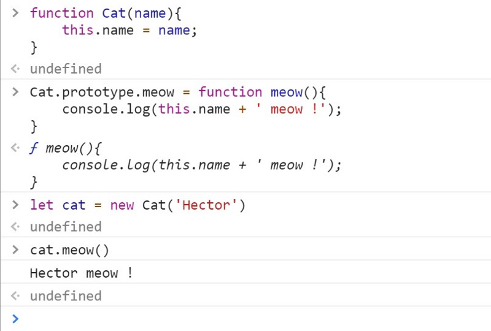

> 키워드 new를 이용하여 cat을 만들었다.

만일 **new** 키워드를 까먹는다면 어떻게 될까? 최상위 오브젝트인 window 오브젝트의 name 프로퍼티만 수정된다.


> **this**가 참조하는 방식의 문제


### 프로토타입은 어디에 존재?

콘솔에서, 프로토타입 체인을 볼 수 있다.


여러분이 만든 cat은 name을 가진 오브젝트이다. 또, meow 함수를 가지고 Cat 생성자 함수를 가진 ***\*proto\**** 라는 오브젝트를 갖고 있다. 이 오브젝트/프로토타입은 또한 자바스크립트 오브젝트 중에 최상위 오브젝트인 **Object**도 갖고 있다. 여기까지 잘 이해하셨다면 프로토타입 체인이 왜 프로토타입 ***체인(chain)\*** 인지 알았을 것이다.

```js
delete cat.__proto__.meow
```

콘솔에 위와 같은 코드를 입력하시면, 모든 고양이의 `meow()` 메소드를 삭제하게 된다. 왜냐하면 모든 고양이가 같은 프로토타입에 대한 참조를 공유하기 때문이다.


이제 Dog 클래스를 만들어봅시다. cat과 같은데 `meow()` 메소드 대신 `bark()` 메소드를 넣을 겁니다.


이제 dog와 cat이 하나씩 있다. 이제 진짜 심각하게 금지된 나쁜 코드를 기기

```js
cat.__proto__ = dog.__proto__
```


 cat이 이젠 짖을(bark) 수 있게 됐다. 아직 Cat이지만 프로토타입은 Dog의 프로토타입을 갖고 있다.

이제 어떻게 자바스크립트에서 모든 것들이 오브젝트의 프로토타입에 연결되는지 이해되기 시작할 것이다.

보셨죠? 이게 자바스크립트가 미친 이유 중 하나다. 단순히 프로토타입만 바꿔버리면 cat이 bark하게 할 수도 있다. 문제는 확실히 이러한 자율성에 있다. 그래서 많은 실수가 일어날 수 있다.


### 이제 class를 써봅시다

> 자바스크립트 클래스는 ECMAScript 2015에서 도입된 현재 존재하는 자바스크립트의 프로토타입 기반 상속을 다루는 ***문법적 부가기능\***입니다. 클래스 문법은 새로운 객체지향 상속 모델을 자바스크립트에 ***도입하진 않습니다.\***

만일 위의 글을 읽었을 때 분명하게 이해되지 않는다면, 왜 새로운 객체지향 모델을 자바스크립트에 도입하지 않았다고 했는지 보여드리겠습니다. 얼마나 객체지향 같지 않은지 한번 보세요.

클래스 문법을 써서 cat과 dog의 예제를 계속해봅시다.

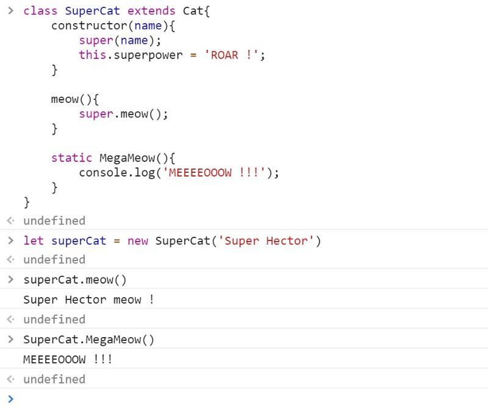

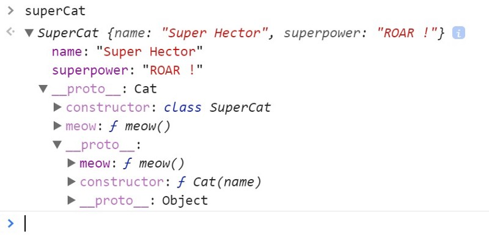

> 확실히 좀 더 큰 고양이입니다.

우리는 extends 키워드를 사용했다. extends의 의미는 사실 우리가 프로토타입 체인에 깊이를 추가했다는 것이다. 지금 우리는 name과 superpower를 가진 superCat 오브젝트를 갖고 있다. superCat 오브젝트는 물론 SuperCat 생성자를 가진 `__proto__` 오브젝트도 갖고 있고 SuperCat 메소드 meow()까지 갖고 있다.

이것이 갖는 의미는 사실 아까 class를 쓰지 않았을 때와 같다. 프로토타입의 프로퍼티나 메소드를 삭제하는 것이 가능하다. 그리고 그렇게 한다면 우리가 생성했던 모든 인스턴스는 망가질 것이다. 아무것도 변하지 않은 것 같지만 class를 사용함으로써 무언가 변했다.

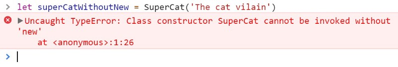

> 이걸 보려고 우린 20년을 기다려야 했다.

우리가 이전에 했던 것처럼 superCat의 프로토타입을 dog의 프로토타입으로 바꿔보자. 프로토타입 세상은 여러분의 것!


클래스 키워드 뒤에는 여전히 예전과 같은 프로토타입 접근법이 있다는 것을 이해했을 것이다.


## 18. Object.create and Object.assign

> 오브젝트는 자바스크립트의 기반이 되는 개념 중 하나입니다. 오브젝트는 기본적으로 프로퍼티들의 컬렉션입니다 그리고 프로퍼티는 키와 값의 조합입니다. 거의 대부분의 자바스크립트 오브젝트는 프로토타입 체인의 top에 위치한 `Object`의 인스턴스입니다.


### 소개(Introduction)

```js
let obj = {
  a: 1,
  b: 2,
};
let copy = obj;

obj.a = 5;
console.log(copy.a);  // 5
```


### 오브젝트를 복사하는 원시적(naive)인 방법

오브젝트를 복사하는 원시적인 방법은 원본 오브젝트의 프로퍼티를 반복하고 각 프로퍼티를 복사하는 것입니다. 예제 코드를 봅시다.

```js
function copy(mainObj) {
  let objCopy = {};  // objCopy will store a copy of the mainObj
  let key;

  for (key in mainObj) {
    objCopy[key] = mainObj[key];  // copies each property to the objCopy object
  }
  return objCopy;
}

const mainObj = {
  a: 2,
  b: 5,
  c: {
    x: 7,
    y: 4,
  },
}

console.log(copy(mainObj));
```

#### 상속 이슈

1. `objCopy`는 `mainObj` 오브젝트 프로토타입 메소드와 다른 새로운 `Object.prototype` 메소드를 갖고 있다. 그건 우리가 원하는 것이 아니다.
2. 프로퍼티 기술자(descriptors)는 복사되지 않는다. `false` 값으로 세팅되는 값을 가진 "작성 가능한" 기술자는 `objCopy`에서는 `true`가 될 것이다.
3. 위의 코드에서는 `mainObj`의 `enumerable` 프로퍼티만을 복사한다.
4. 만일 원본 오브젝트에서의 프로퍼티 중 하나가 오브젝트 그 자체라면, 그 오브젝트는 각각의 프로퍼티에서 같은 오브젝트를 참조하게 되며 복사본과 원본 사이에서 공유된다.


### 얕은(Shallow) 오브젝트 복사하기

소스 최상위 레벨 프로퍼티들이 어떠한 참조없이 복사될 때, 오브젝트는 얕게 복사된다고 한다. 그리고 레퍼런스로 복사된 오브젝트 값을 가진 소스 프로퍼티가 존재하게 된다. 만일 소스 값이 오브젝트를 가리키는 레퍼런스라면, 결국 타겟 오브젝트를 가리키는 레퍼런스 값만 복사하게 된다.

얕은 복사는 최상위 레벨 프로퍼티들을 복사한다. 하지만 중첩된 오브젝트들은 원본(original, source)과 복사본(copy, target)사이에서 공유된다.


### `Object.assign()` 메소드 사용하기

`Object.assign()` 메소드는 하나 또는 그 이상의 원본 오브젝트로부터 복사본 오브젝트로 모든 enumerable한 프로퍼티의 값을 복사하기 위해 사용된다. 반환 값은 물론 복사본 오브젝트이다.

```js
let obj = {
  a: 1,
  b: 2,
};
let objCopy = Object.assign({}, obj);
console.log(objCopy);  // { a: 1, b: 2 }
```

```js
let obj = {
  a: 1,
  b: 2,
};
let objCopy = Object.assign({}, obj);

console.log(objCopy);  // { a: 1, b: 2 }
objCopy.b = 89;
console.log(objCopy);  // { a: 1, b: 89 }
console.log(obj);  // { a: 1, b: 2 }
```

원본 오브젝트에서 참조 없이 성공적으로 오브젝트 복사에 성공했다.


### `Object.assign()`의 함정

```js
let obj = {
  a: 1,
  b: {
    c: 2,
  },
}
let newObj = Object.assign({}, obj);
console.log(newObj);  // { a: 1, b: { c: 2} }

obj.a = 10;
console.log(obj);  // { a: 10, b: { c: 2} }
console.log(newObj);  // { a: 1, b: { c: 2} }

newObj.a = 20;
console.log(obj);  // { a: 10, b: { c: 2} }
console.log(newObj);  // { a: 20, b: { c: 2} }

newObj.b.c = 30;
console.log(obj);  // { a: 10, b: { c: 30} }
console.log(newObj);  // { a: 20, b: { c: 30} }

// Note: newObj.b.c = 30; Read why..
```

#### 왜 obj.b.c = 30일까?

`Object.assign()`의 함정은 바로 얕은 복사만 가능하다는 것이다.

위의 소스에서 `newObj.b`와 `obj.b` 둘 다 같은 레퍼런스를 공유한다. 왜냐면 개개에 대한 카피는 이뤄지지 않았으니까. 대신 오브젝트를 가리키는 레퍼런스만 복사됐다. 이 경우, 오브젝트의 프로퍼티를 변화시키면 오브젝트를 사용하는 모든 레퍼런스에 변화가 적용된다.

> 알아둬야 할 것 : 프로토타입 체인의 프로퍼티 그리고 non-enumerable한 프로퍼티들은 복사될 수 없다.

```js
let someObj = {
  a: 2,
}

let obj = Object.create(someObj, { 
  b: {
    value: 2,  
  },
  c: {
    value: 3,
    enumerable: true,  
  },
});

let objCopy = Object.assign({}, obj);
console.log(objCopy); // { c: 3 }
```

- `someObj`는 obj의 프로퍼티 체인에 있습니다 그래서 복사되지 않는다.
- `property b`는 non-enumerable 프로퍼티이다.
- `property c`는 enumerable 프로퍼티 기술자가 enumerable하게 만들어주고 있다. 그래서 이 프로퍼티는 복사된다.


### 오브젝트 깊은 복사하기

깊은 복사는 만나는 모든 오브젝트를 복사할 것이다. 복사본과 원본 오브젝트는 어느 프로퍼티도 공유하지 않을 것이다. 여기서 `Object.assign()`을 사용할 때 만나게 되는 문제점을 해결할 것이다.


#### JSON.parse(JSON.stringify(object)) 사용하기

```js
let obj = { 
  a: 1,
  b: { 
    c: 2,
  },
}

let newObj = JSON.parse(JSON.stringify(obj));

obj.b.c = 20;
console.log(obj);  // { a: 1, b: { c: 20 } }
console.log(newObj);  // { a: 1, b: { c: 2 } } (New Object Intact!)
```

불변성: ✓


#### 함정(Pitfall)

불행하게도, 이 메소드는 사용자 정의 오브젝트 메소드를 복사하는데 이용될 수는 없다.


### 오브젝트 메소드 복사하기

메소드는 오브젝트의 함수 프로퍼티이다. 지금까지의 예제에서, 우리는 오브젝트의 메소드를 복사했던 적은 없다. 이제 한번 시도해볼 것입니다. 그리고 복사를 위해 배웠던 메소드들을 사용할 것입니다.

```js
let obj = {
  name: 'scotch.io',
  exec: function exec() {
    return true;
  },
}

let method1 = Object.assign({}, obj);
let method2 = JSON.parse(JSON.stringify(obj));

console.log(method1);
/* result
{
  exec: function exec() {
    return true;
  },
  name: "scotch.io"
}
*/

console.log(method2);
/* result
{
  name: "scotch.io"
}
*/
```

위의 소스의 결과는 `Object.assign()`이 메소드를 복사하는데 사용될 수 있다는 결과를 보여준다. 반면에 `JSON.parse(JSON.stringify(obj))`는 사용될 수 없다.


### 순환하는 오브젝트 복사하기

순환하는 오브젝트는 그들 자신을 참조하는 프로퍼티를 가진 오브젝트다.


#### JSON.parse(JSON.stringify(object)) 사용하기

```js
// circular object
let obj = { 
  a: 'a',
  b: { 
    c: 'c',
    d: 'd',
  },
}

obj.c = obj.b;
obj.e = obj.a;
obj.b.c = obj.c;
obj.b.d = obj.b;
obj.b.e = obj.b.c;

let newObj = JSON.parse(JSON.stringify(obj));

console.log(newObj); 
```


`JSON.parse(JSON.stringify(object))`는 순환하는 오브젝트를 복사할 수 없다.


#### Object.assign() 사용하기

```js
// circular object
let obj = { 
  a: 'a',
  b: { 
    c: 'c',
    d: 'd',
  },
}

obj.c = obj.b;
obj.e = obj.a;
obj.b.c = obj.c;
obj.b.d = obj.b;
obj.b.e = obj.b.c;

let newObj2 = Object.assign({}, obj);

console.log(newObj2); 
```

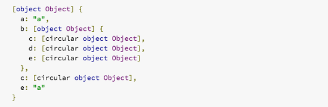

`Object.assign()`는 순환하는 오브젝트를 얕은 복사하는데 아무런 문제가 없지만 깊은 복사는 여전히 할 수 없다. 


### Spread Elements 사용하기 (...)

ES6는 이미 배열 해체 할당과 구현된 어레이 리터럴을 위한 확장 엘리먼트를 가지고 있습니다. 배열에 대한 확장 엘리먼트 구현을 한번 보세요.

```js
const array = [
  "a",
  "c",
  "d", {
    four: 4
  },
];
const newArray = [...array];
console.log(newArray);
// Result 
// ["a", "c", "d", { four: 4 }]
```

```js
let obj = {
  one: 1,
  two: 2,
}

let newObj = { ...z };

// { one: 1, two: 2 }
```

> 알아두세요: 오직 얕은 복사에만 적용됩니다.


## 19. map, reduce, filter


### 함수형 프로그래밍이란 무엇인가?

함수형 프로그래밍은 함수의 출력 값이 오직 함수로 넘어온 아규먼트에만 의존하는 프로그래밍 패러다임이다. 함수를 몇번 호출하든 항상 같은 결과를 낳는다. 사실 앞서 설명한 특성은 현재 존재하는 local 또는 global한 변수를 이용하여 매 실행마다 다른 결과를 내보낼 수 있는 공통적이고 현대적인 코드와 대비된다. **상태의 변화는 side-effect를 발생시킨다. 매번 다른 결과를 내보내는 코드를 제거하는 것은 코드의 동작을 더 쉽게 이해하고 예측할 수 있게 만들어준다.**


### 왜 Map, Filter, Reduce 인가?


#### Map

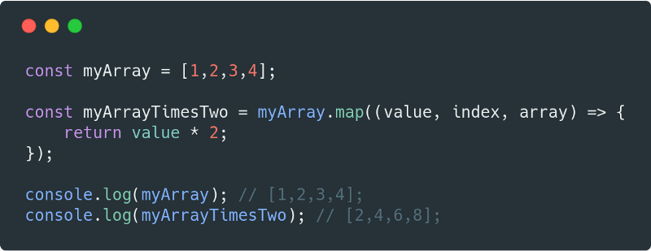

위에서 볼 수 있듯, **map** 은 인자로 콜백을 받는다. map이 호출될 때, 이 콜백에 현재 **값의 iteration**, **iteration의 index** 그리고 **원본 배열** 이 주어진다. map을 위한 optional한 두번째 인자도 있다. 두번째 인자는 콜백 내부에서 **this**를 이용하기 위한 값이다.


##### 예제

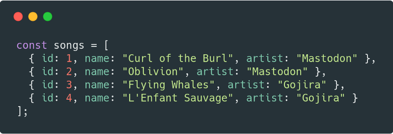
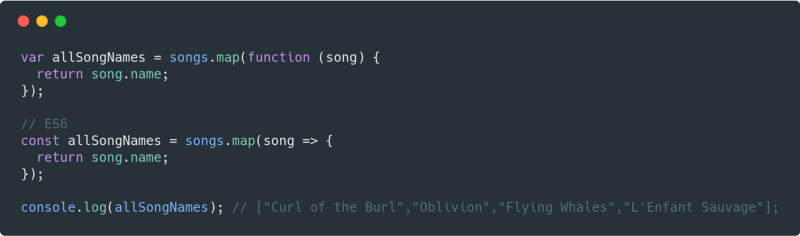
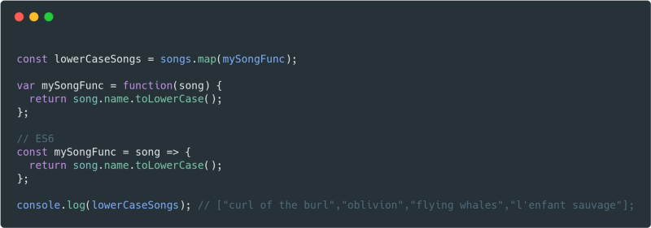
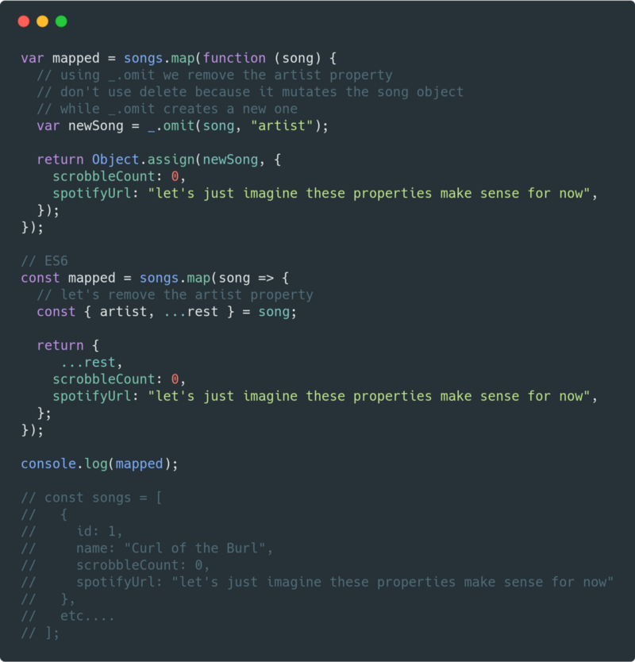


#### Filter

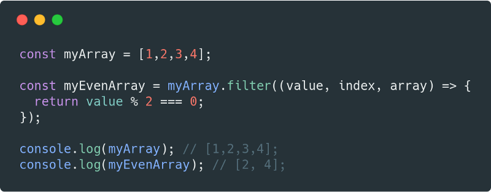

**Filter**는 map과 같은 인자를 받는다 그리고 매우 비슷하게 동작한다. 유일한 다른 점은 콜백이 **true** 또는 **false**로 반환되어야 한다는 것이다. 만일 **true**를 반환한다면 배열이 그 원소를 계속 갖고 있고, 만일 **false**를 반환한다면 필터링된다.


##### 예제
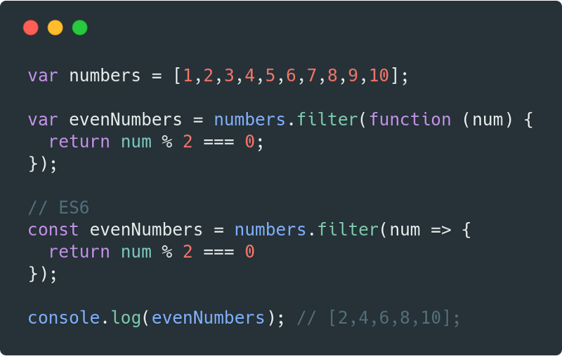
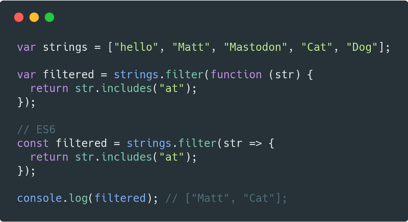
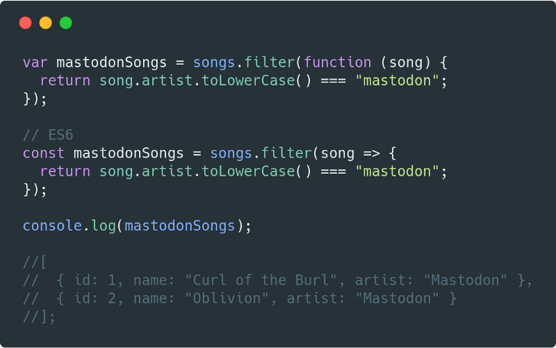


#### Reduce

 **reduce**는 배열 하나를 받아서 하나의 값으로 바꿔준다. 예를 들어, 숫자의 배열을 가지고 있을 때, 쉽게 모든 값의 평균을 구할 수 있다.


##### 어떻게 사용하나요?

**map**과 **filter**와 비슷하다. 콜백 인자에서 좀 다른 점이 있다. 콜백은 이제 **accumulator**를 받는다. accmulator는 모든 반환 값을 누적한다. reduce 함수의 두번째 인자 값이 accumulator의 초기 값이다.

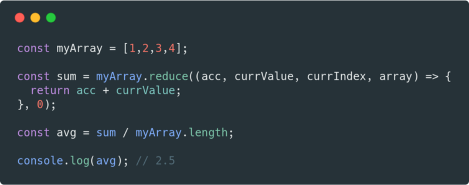


##### 예제
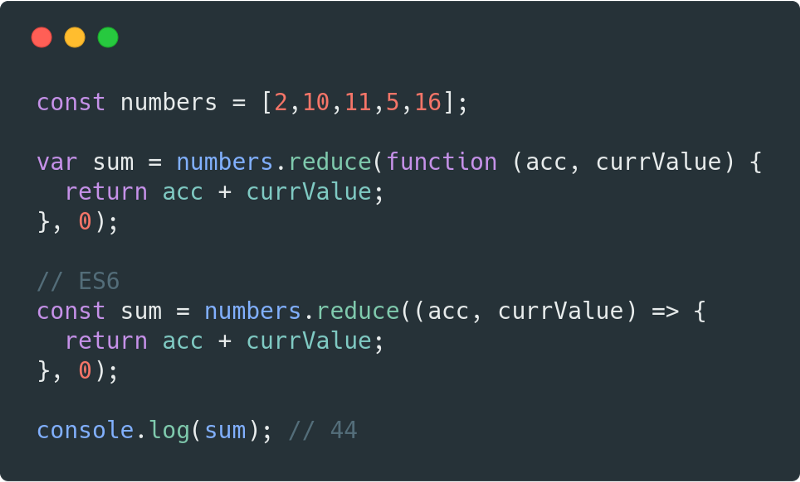
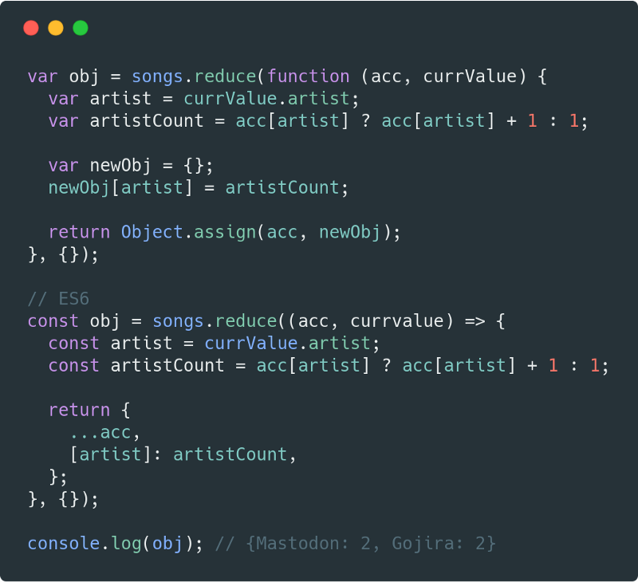
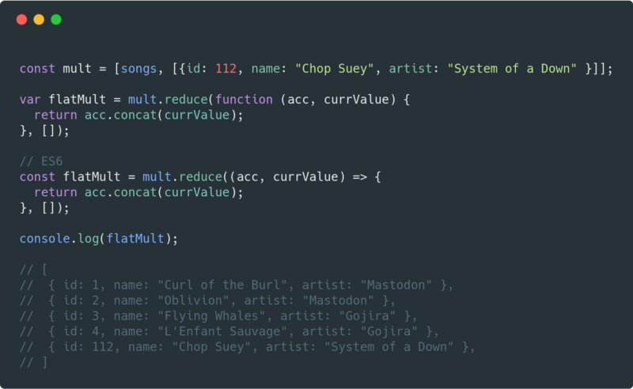


#### 삼위일체

**Map, Filter, Reduce** 는 같이 연계로 사용할 수 있다.

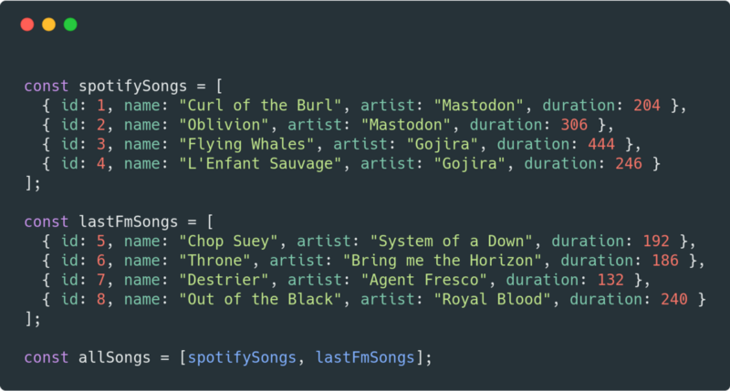


### 왜 Map, Filter, Reduce를 사용해야 할까?

- 바로 현재 값에 접근할 수 있기 때문이다. (array[i]와 같은 형식으로 접근하려면 매우 불편하죠.)
- 기존 배열의 변화를 방지할 수 있기 때문이다. (immutable) 그래서, side-effect를 최소화할 수 있습니다.
- **for** loop을 관리할 필요가 없다.
- 빈 배열을 만들고 거기에 push할 필요가 없다.
- **콜백에서 RETURN문을 기억해라.**


## 20. Pure Functions, Side Effects and State Mutation


### 함수란 무엇인가?

**함수** 는 **인자(arguments)** 라 불리는 것을 입력 값으로 받고 **반환 값(return value)** 이라 불리는 결과물을 생성해낸다.

- **맵핑(Mapping)** : 주어진 입력 값을 기반으로 어떤 출력 값을 생성한다. 말 그대로 어떠한 입력 값을 출력 값으로 **맵핑** 해준다.
- **프로시져(Procedures)** : 함수는 어떠한 일련의 과정을 수행하기 위해서 호출될 수 있다. 이 과정이 일반적으로 프로시져라고 알려져 있다. 그리고 이러한 스타일로 작성하는 프로그래밍은 **프로시져형 프로그래밍(procedural programming)** 으로 알려져 있다.
- **I/O** : 시스템의 다른 부분과 통신하기 위해서 존재하는 함수들이다. 이를테면 화면, 저장소, 시스템 로그, 네트워크 등이 있다.


### 맵핑

순수 함수는 맵핑에 관한 것이다. 함수는 입력 인자 값을 반환 값으로 맵핑한다. 이 말은 어떠한 입력 값이 있다면 출력 값이 존재한다는 것이다. 한 함수는 입력 값을 받고 그에 상응하는 출력 값을 내보낸다.

*`'Math.max()'`* 함수는 인자 값으로 숫자들을 받고 가장 큰 숫자를 반환한다.

```js
Math.max(2, 8, 5);  // 8
```

```js
const double = x => x * 2;
```

```js
console.log( double(5) ); // 10
```


### 순수 함수

순수 함수는 다음의 특성을 지닌 함수다.

- 같은 입력을 받았을 때, 같은 출력을 반환한다.
- side-effect를 갖지 않는다.

*함수가 순수하지 않다는 것의 명백한 증거는 그 함수가 반환 값을 사용하지 않으면서도 호출했을 때 올바른 동작이 가능한지에 달렸다. 순수 함수는 반환 값을 사용하지 않으면서는 올바른 동작을 할 수 없다.*

실제로 순수 함수를 이용하여 구현할 수 있는 프로그램 요구사항이라면, 당신이 다른 옵션을 선택하기보단 순수 함수를 사용하는 것을 권장한다. 순수 함수는 어떤 입력 값을 받고 그 입력 값을 기반으로 출력 값을 반환한다. 순수함수는 프로그램 안에서 가장 간단한 재사용 가능한 빌딩 블록이다. 아마, 컴퓨터 사이언스에서 가장 중요한 디자인 원칙은 KISS (Keep It Simple, Stupid)이다. 저는 KISS 원칙을 선호한다. 순수 함수는 존재하는 방식 중 가장 간단하고 단순히다.

순수함수는 이익(beneficial)이 되는 속성(properties)들을 많이 갖고 있다. 그리고 **함수형 프로그래밍**의 기반을 형성한다. 순수 함수는 바깥 상태로부터 완벽히 독립적이다. 그리고 공유된 변화하는 상태들에 관련된 클래스의 버그로부터 완전히 면역(immune)이다. 순수함수의 독립적인 특성은 또한 순수함수를 많은 CPU들 사이, 그리고 과학적이고 리소스가 많이 드는 컴퓨팅 테스크를 위해 필수적인 분배된 컴퓨팅 클러스터들 사이에서 병렬 프로세싱을 수행하기 위한 좋은 후보지로 만들어준다.

순수 함수는 굉장히 독립성이 있다. 움직이기 쉽고 리팩토링하기 쉽고 다시 재구성하기도 쉽다.


### 공유되는 상태의 문제점

몇년 전 저는 사용자가 데이터베이스에서 가수를 찾고 그 가수의 노래 목록을 웹 플레이어로 불러올 수 있도록 하는 앱을 작업한 적이 있다. 유일한 문제는 사용자가 종종 API의 자동완성 검색 결과가 나오는 것보다 빠르게 타이핑을 끝마쳐버린다는 것이었다.이러한 문제는 꽤 이상한 버그를 만들어냈다. 새로운 검색 제안(suggestion)을 오래된 검색 제안(suggestion)이 대체해버리는 경쟁 상태(race condition)을 유발했다.

왜? 왜냐하면 각각의 AJAX success 핸들러는 사용자에게 표기되는 검색 제안을 즉시 업데이트 할 접근 권한을 받았기 때문이다. 가장 느린 AJAX 요청이 항상 빠르게 끝난 요청들과 대체되며 사용자의 관심을 끌었을 것이다. 심지어 대체되기 전 결과가 더욱 새로운 검색결과였을 때도.

이 문제를 해결하기 위해, 저는 제안 관리자를 만들었다. 쿼리의 상태를 관리하기 위한 싱글 소스이다. 이 제안 매니저는 현재 불러오고 있는 AJAX 요청에 대해 알고 있고 유저가 새로운 무언가를 타이핑했을 때, 새로운 요청을 불러오기 전에 요청 중이던 AJAX 리퀘스트는 취소한다. 그래서 단일 답변 핸들러만 UI 상태 업데이트를 변경할 수 있게 한다.

어떤 종류의 비동기 연산 또는 동시작업이든 비슷한 종류의 레이스 컨디션(race condition)을 발생시킬 수 있다. 레이스 컨디션은 출력 값이 통제할 수 없는 이벤트(이를테면 네트워크, 디바이스 지연율, 유저 입력, 랜덤성...)의 순서에 의존할 때 발생한다. 사실, 여러분이 공유된 상태를 사용 중이고 그 상태가 결정되지 않은 요인들에 의존하여 순서가 멋대로 분기될 수 있다면, 출력 값은 예측할 수 없다. 그리고 이 말은 즉, 올바르게 테스트될 수 없고 완전히 이해할 수도 없다는 것이다. Martin Odersky(스칼라의 창시자)는 다음과 같이 말했다.

> 비결정론 = 병렬 처리 + 변할 수 있는 상태이다.

프로그램 결정론은 컴퓨팅에서 바람직한 속성이다. 자바스크립트가 싱글스레드에서 돌기 때문에 괜찮고 병렬 처리 문제에 관해 생각할 필요가 없다고 생각할 수도 있지만 AJAX 예제가 보여주었듯, 자바스크립트 엔진이 싱글스레드라고 동시처리가 없다고 생각하시면 안된다. 반대로, 동시 처리의 많은 소스들이 자바스크립트 내부에 있다. API I/O, 이벤트 리스너, 웹 워커, Iframes, 그리고 timeouts는 여러분의 프로그램을 비결정론의 세계로 인도할 것이다.

순수 함수는 이러한 버그를 피할 수 있도록 도와준다.


### 같은 입력값이 들어왔을 때, 항상 같은 출력이 나온다.

`double()` 메소드를 썼던 것과 같이, 우리는 결과 값에 결과 대신에 함수를 넣어줄 수 있다. 그래도 프로그램은 여전히 같은 의미를 갖게 될 것이다. `double(5)`는 프로그램에서 언제나 `10`과 같은 의미를 갖는다.

하지만 모든 함수에서 동일하게 적용된다고 할 순 없습니다. 몇몇 함수는 인자로 들어오는 값보다 어떤 특정한 정보에 의존합니다.

```js
Math.random(); // => 0.4011148700956255
Math.random(); // => 0.8533405303023756
Math.random(); // => 0.3550692005082965
```

함수를 호출할 때 우리가 아무런 인자도 넘기지 않았음에도 불구하고, 이 함수들은 각각 다른 출력 값을 만들어냅니다. 이 사실이 의미하는 바는 `Math.random()` 함수는 **순수하지 않다**는 것이다.

```js
const time = () => new Date().toLocaleTimeString();
time(); // => "5:15:45 PM"
```

만일 여러분이 `time()` 함수 호출 부분을 현재 시간으로 바꾸면 어떤 일이 일어날까?

그렇다면 언제나 같은 시간이 나올 것이다. 함수가 대체된 시점의 시간이 계속 나올 것이다. 그렇게 되면, 만일, 함수가 대체된 시점에만 프로그램을 실행시키면 하루에 한 번은 맞는 출력 값을 생성할 수는 있다.

**함수가 같은 입력 값을 받고 같은 출력 값을 반환한다면 함수는 순수(pure)하다.**

같은 입력 값은 항상 같은 출력 값으로 맵핑될 것이다. 하지만, 많은 입력 값은 같은 출력 값으로 맵핑될 수도 있는것이다. 예를 들면, 다음 함수는 **순수**하다.

```js
const highpass = (cutoff, value) => value >= cutoff;
```

같은 입력 값은 항상 같은 출력 값으로 매핑될 것이다.

```js
highpass(5, 5); // => true
highpass(5, 5); // => true
highpass(5, 5); // => true
```

많은 입력 값은 같은 출력 값으로 맵핑될 수도 있다.

```js
highpass(5, 123); // => true
highpass(5, 6); // => true
highpass(5, 18); // => true

highpass(5, 1); // => false
highpass(5, 3); // => false
highpass(5, 4); // => false
```

순수 함수는 절대 외부의 변환 가능한 값에 의존해선 안된다. 왜냐하면 그렇게 되면 더이상 결정론적이지 않거나 참조적으로 투명하지도 않기 때문이다.


### 순수 함수는 어떠한 Side-effect도 만들지 않는다.

순수 함수는 어떠한 Side-effect도 만들지 않는다. 즉, 순수함수는 어떤 외부 상태도 변환하지 않는 다는 것을 의미한다.


### 불변성

자바스크립트의 오브젝트는 레퍼런스들이다. 이 의미는 만일 함수가 오브젝트나 배열 파라미터에 변화를 가하면, 함수 밖의 접근 가능한 상태를 변화시킨다는 이야기이다. 순수 함수는 외부 상태를 변화시켜선 안된다.

다음 소스는 **순수하지 않은** `addToCart()` 함수이다.

```js
// 비순수 addToCart 함수는 존재하는 cart를 변환시킨다.
const addToCart = (cart, item, quantity) => {
  cart.items.push({
    item,
    quantity
  });
  return cart;
};


test('addToCart()', assert => {
  const msg = 'addToCart() should add a new item to the cart.';
  const originalCart =     {
    items: []
  };
  const cart = addToCart(
    originalCart,
    {
      name: "Digital SLR Camera",
      price: '1495'
    },
    1
  );

  const expected = 1; // num items in cart
  const actual = cart.items.length;

  assert.equal(actual, expected, msg);

  assert.deepEqual(originalCart, cart, 'mutates original cart.');
  assert.end();
});
```

위의 코드는 카트와 카트에 추가할 아이템 그리고 아이템 개수(quantity)를 넘김으로써 작동한다. 함수는 아이템이 추가된 같은 카트를 반환한다.

위 소스코드의 문제는 우리가 어떤 공유된 상태를 변화시켰다는 것이다. 다른 함수들이 함수가 수행되기 전 상태의 cart 오브젝트에 의존하고 있을 수도 있다. 우리가 어떤 함수가 호출되는지 순서를 바꾼다면, 이러한 변화가 프로그램 로직에 어떤 영향을 줄지에 대해서 걱정해보아야 한다. 코드를 리팩토링하는 것은 버그를 만들어낼 수 있고 순서를 꼬아버릴 수 있다.

**순수함수** 버전

```js
// 순수한 addToCart() 함수는 새로운 카트를 반환합니다.
// 기존의 오브젝트를 변환하지 않습니다.
const addToCart = (cart, item, quantity) => {
  const newCart = lodash.cloneDeep(cart);

  newCart.items.push({
    item,
    quantity
  });
  return newCart;

};


test('addToCart()', assert => {
  const msg = 'addToCart() should add a new item to the cart.';
  const originalCart = {
    items: []
  };

  // deep-freeze on npm
  // throws an error if original is mutated
  deepFreeze(originalCart);

  const cart = addToCart(
    originalCart,
    {
      name: "Digital SLR Camera",
      price: '1495'
    },
    1
  );


  const expected = 1; // num items in cart
  const actual = cart.items.length;

  assert.equal(actual, expected, msg);

  assert.notDeepEqual(originalCart, cart,
    'should not mutate original cart.');
  assert.end();
});
```

이 예제에서, 우리는 오브젝트에 중첩된 배열을 갖고 있다. 그래서 deep clone을 이용하여 복사하였다. 이러한 상황은 일반적으로 여러분이 다룰 상황보다 더욱 복잡한 상태다. 여러분은 이걸 더욱 작은 조각으로 떼어낼 수 있다.

예를 들면, 리덕스는 각각 리듀서 안에 들어있는 전체 앱 상태를 다루기보다 리듀서를 구성한다. 결과는 매번 작은 부분을 업데이트하고 싶을 때마다 여러분이 전체 앱의 deep clone을 만들 필요가 없다는 것이다.대신, 앱 상태의 작은 부분을 업데이트 하기 위해 파괴적이지 않은 배열 메소드나 `Object.assign()`을 사용할 수 있다.