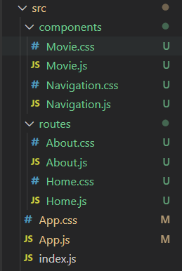

# 노마드코더 ReactJS로 영화 웹 서비스 만들기


### #0 INTRODUCTION

---


### #1 SETUP

---

1. ##### 초기 세팅

   - node.js
   - npm
   - npx
   - visual studio code
   - git


2. ##### react app 생성

```bash
npx create-react-app my_first_app_2021
```

 

3. ##### react app 실행

```bash
npm start
```


### #2 JSX & PROPS

---

- ##### compontent : HTML을 반환하는 함수
- ##### jsx : 자바스크립트랑 HTML사이의 조합!

- ##### PropTypes를 이용한 형식 검증

```bash
npm i prop-types
npm i
npm start
```


##### src/Potato.js

```js
function Potato() {
    return (
        <h3>I love potato</h3>
    )
}

export default Potato
```


##### src/index.js

```js
import ReactDOM from 'react-dom'
import App from './App'

ReactDOM.render(
  <App />, // 하나의 component만 반환, 따라서 App안에 다 넣어야 함
  document.getElementById('root') // 아래의 index.html~!
)
```


##### public/index.html

```html
<div id="root"></div>
    <!--
      This HTML file is a template.
      If you open it directly in the browser, you will see an empty page.

      You can add webfonts, meta tags, or analytics to this file.
      The build step will place the bundled scripts into the <body> tag.

      To begin the development, run `npm start` or `yarn start`.
      To create a production bundle, use `npm run build` or `yarn build`.
    -->
```


##### src/App.js

```js
import PropTypes from "prop-types"
// import Potato from "./Potato"

// 함수의 매개변수로 넣을 수 있는 형태들
// 1. ( props )
// 2. ( props.fav )
// 3. ({ fav })
// function Food({ fav }) {
//   return (
//       <h3>I love { fav }</h3>
//   );
// }

const foodILike = [
  {
    id: 1,
    name: "gimbab",
    image:
      "imgurl",
    rating: 8,
  },
  {
    id: 2,
    name: "chicken",
    image:
      "imgurl2",
    rating: 8.8,
  },
  {
    id: 3,
    name: "pizza",
    image:
      "imgurl3",
    rating: 9.2,
  },
]

function Food({ name, picture, rating }) {
  return (
    <div>
      <h3>I love { name }</h3>
      <h4>{ rating }/10.0</h4>
      
    </div>
  )
}

// PropTypes 사용법 체크
Food.propTypes = {
  name: PropTypes.string.isRequired,
  picture: PropTypes.string.isRequired,
  rating: PropTypes.number.isRequired,
}

// 주인공은 나야나~
function App() {
  return (
    <div>
      // map 사용법 체크
      {foodILike.map(dish => (
        <Food key={ dish.id } name={ dish.name } picture={ dish.image } rating={ dish.rating } />
      ))}
    </div>
  )
}

// 내보내기~!
export default App
```


### #3 STATE

---

##### src/App.js

```js
import React from "react"

// react component에서 상속받는 App component
// react는 자동적으로 class component의 render method를 실행!
// 왜 function이 아니라 class component 써야돼?
// => class component는 state를 갖고 있음, state는 object이고, component의 data를 넣을 공간이 있고, 이 데이터는 변함
class App extends React.Component{
  // constructor : component가 mount될 때 가장 먼저 실행되는 function => js에서 옴
  constructor(props) {
    super(props)
    console.log("hello")
  }
  state = {
    count: 0
  }
  plus = () => {
    // setState : 새 state와 함께 render function이 실행되도록 해줌
    // this.setState({count: this.state.count + 1})
    this.setState(current => ({count: current.count + 1}))
  }
  minus = () => {
    this.setState(current => ({count: current.count - 1}))
  }
  // componentDidMount : component가 처음 mount된 후 한번만 실행
  componentDidMount() {
    console.log("component rendered")
  }
  // componentDidUpdate : component가 처음 update되면 실행
  componentDidUpdate() {
    console.log("I'm just updated")
  }
  
  // componentWillUnmount : component가 떠날 때 실행 => 다른페이지로 가는 등
  componentWillUnmount() {
    console.log("goodbye")
  }
  render() {
    console.log("i am rendering")
    return (
      <div>
        <h1>The number is { this.state.count }</h1>
        <button onClick={ this.plus }>Plus</button>
        <button onClick={ this.minus }>Minus</button>
      </div>
    )
  }
}

export default App
```


```js
import React from "react"

class App extends React.Component {
  state = {
    isLoading: true,
    movies: []
  };
  componentDidMount() {
    setTimeout(() => {
      this.setState({isLoading: false})
      }, 6000); // 6초 후에 바뀜~!
  }
  render() {
    const { isLoading } = this.state
    return <div>{ isLoading ? "Loading..." : "We are ready" }</div>
  }
}

export default App
```


### #4 MAKING THE MOVIE APP

---

- ##### axios

```bash
npm i axios
```


- ##### API => YTS

```
https://yts-proxy.now.sh//list_movies.json // 노마드코더 제공 => 추후 url이 바뀔 것을 대비해서~!
https://yts.mx/api/v2/list_movies.json // 사이트
```


##### src/App.js

```js
import React from "react"
import axios from "axios"
import Movie from "./Movie"
import "./App.css"

class App extends React.Component {
  state = {
    isLoading: true,
    movies: []
  }
  getMovies = async() => {
    const {
      data: {
        data: { movies }
      }
    } = await axios.get(
      "https://yts-proxy.now.sh/list_movies.json?sort_by=rating"
    ) // sort_by
    this.setState({ movies, isLoading: false })
  }
  componentDidMount() {
    this.getMovies()
  }
  render() {
    const { isLoading, movies } = this.state
    return (
      <section className="container">
        {isLoading ? (
          <div className = "loader">
            <span className = "loader__text">Loading...</span>
          </div>
        ) : (
          <div className = "movies">
            {movies.map(movie => (
              <Movie
                key={ movie.id }
                id={ movie.id }
                year={ movie.year }
                title={ movie.title }
                summary={ movie.summary }
                poster={ movie.medium_cover_image }
                genres={ movie.genres }
              />
            ))}
          </div>
        )}
      </section>
    )
  }
}

export default App
```


##### src/Movie.js

```js
import React from "react"
import PropTypes from "prop-types"
import "./Movie.css"

function Movie({ id, year, title, summary, poster, genres }) {
    return (
        <div className="movie">
            
            <div className="movie__data">
                <h3 className="movie__title">{ title }</h3>
                <h5 className="movie__year">{ year }</h5>
                <ul className="movie__genres">
                    {genres.map((genre, idx) => (
                        <li key={ idx } className="genres__genre">s
                            { genre }
                        </li>
                    ))}
                </ul>
                <p className="movie__summary">{ summary.slice(0, 180) }...</p>
            </div>
        </div>
    )
}

Movie.propTypes = {
    id: PropTypes.number.isRequired,
    year: PropTypes.number.isRequired,
    title: PropTypes.string.isRequired,
    summary: PropTypes.string.isRequired,
    poster: PropTypes.string.isRequired,
    genres: PropTypes.arrayOf(PropTypes.string).isRequired,
}

export default Movie
```


##### src/Movie.css

```css
.movies .movie {
  width: 45%;
  background-color: white;
  margin-bottom: 70px;
  display: flex;
  align-items: flex-start;
  justify-content: space-between;
  font-weight: 300;
  padding: 20px;
  border-radius: 5px;
  color: #adaeb9;
  box-shadow: 0 13px 27px -5px rgba(50, 50, 93, 0.25),
    0 8px 16px -8px rgba(0, 0, 0, 0.3), 0 -6px 16px -6px rgba(0, 0, 0, 0.025);
}

.movie img {
  position: relative;
  top: -50px;
  max-width: 150px;
  width: 100%;
  margin-right: 30px;
  box-shadow: 0 30px 60px -12px rgba(50, 50, 93, 0.25),
    0 18px 36px -18px rgba(0, 0, 0, 0.3), 0 -12px 36px -8px rgba(0, 0, 0, 0.025);
}

.movie .movie__title,
.movie .movie__year {
  margin: 0;
  font-weight: 300;
}

.movie .movie__title {
  margin-bottom: 5px;
  font-size: 24px;
  color: #2c2c2c;
}

.movie .movie__genres {
  list-style: none;
  padding: 0;
  margin: 0;
  display: flex;
  margin: 5px 0px;
}

.movie__genres li,
.movie .movie__year {
  margin-right: 10px;
  font-size: 14px;
}
```


##### src/App.css

```css
* {
  box-sizing: border-box;
}

body {
  margin: 0;
  padding: 0;
  font-family: -apple-system, BlinkMacSystemFont, "Segoe UI", Roboto, Oxygen,
    Ubuntu, Cantarell, "Open Sans", "Helvetica Neue", sans-serif;
  background-color: #eff3f7;
  height: 100%;
}

html,
body,
#potato,
.container {
  height: 100%;
  display: flex;
  justify-content: center;
}
.loader {
  width: 100%;
  height: 100%;
  display: flex;
  justify-content: center;
  align-items: center;
  font-weight: 300;
}

.movies {
  display: flex;
  justify-content: space-between;
  align-items: flex-start;
  flex-wrap: wrap;
  padding: 50px;
  padding-top: 70px;
  width: 80%;
}
```


### #5 CONCLUSIONS

---

- ##### gh-pages

  - 웹사이트를 github의 github page 도메인에 나타나게 해줌
  - 레파지토리를 public으로!

```bash
npm i gh-pages
```


##### package.json

```json
{ // 첫 괄호에 추가, 홈페이지 링크는 아래와 같이 규정되어 있으니까 따를 것:)
	"homepage": "http://linibell.github.io/my_first_app_2021"
}
```

```bash
npm run build
```


##### package.json

```json
"scripts": { // scripts 내에 추가
    "deploy": "gh-pages -d build",
    "predeploy": "npm run build"
}
```

```bash
npm run deploy
```


### #6 ROUTING BONUS

---

- ##### react router dom

  - 네비게이션 패키지

```bash
npm i react-router-dom
```


- src에 components, routes 폴더 생성
- Movie.css, Movie.js는 components로 이동하고, routes 폴더 내에 Home.js, Home.css 생성해서 App.js, App.css 복붙
- 사진에 없는 새로운 파일들 생성




##### src/App.js

```javascript
import React from "react"
import { HashRouter, Route } from "react-router-dom"
import Home from "./routes/Home"
import About from "./routes/About"
import Detail from "./routes/Detail"
import Navigation from "./components/Navigation"
import "./App.css"


function App() {
  return (
    // HashRouter : # 이거 있는 요상한 칭구~ BrowerRouter라는 것도 있음!
    <HashRouter>
      {/* <Route path="/home">
        <h1>Home</h1>
      </Route>
      <Route path="/home/introduction">
        <h1>Introduction</h1>
      </Route>
      <Route path="/about">
        <h1>About</h1>
      </Route> */}
      {/* Navigation은 props가 없고, Route는 있음 for sharing information */}
      <Navigation />
      <Route path="/" exact={ true } component={ Home } />
      <Route path="/about" component={ About } />
      <Route path="/movie/:id" component={Detail} />
    </HashRouter>
  )
}

export default App
```


##### src/App.css

```css
* {
  box-sizing: border-box;
}

body {
  margin: 0;
  padding: 0;
  font-family: -apple-system, BlinkMacSystemFont, "Segoe UI", Roboto, Oxygen,
    Ubuntu, Cantarell, "Open Sans", "Helvetica Neue", sans-serif;
  background-color: #eff3f7;
  height: 100%;
}
```


##### src/routes/Home.js

```javascript
import React from "react"
import axios from "axios"
import Movie from "../components/Movie"
import "./Home.css"


class Home extends React.Component {
  state = {
    isLoading: true,
    movies: []
  }
  getMovies = async() => {
    const {
      data: {
        data: { movies }
      }
    } = await axios.get(
      "https://yts-proxy.now.sh/list_movies.json?sort_by=rating"
    ) // sort_by
    this.setState({ movies, isLoading: false })
  }
  componentDidMount() {
    this.getMovies()
  }
  render() {
    const { isLoading, movies } = this.state
    return (
      <section className="container">
        {isLoading ? (
          <div className = "loader">
            <span className = "loader__text">Loading...</span>
          </div>
        ) : (
          <div className = "movies">
            {movies.map(movie => (
              <Movie
                key={ movie.id }
                id={ movie.id }
                year={ movie.year }
                title={ movie.title }
                summary={ movie.summary }
                poster={ movie.medium_cover_image }
                genres={ movie.genres }
              />
            ))}
          </div>
        )}
      </section>
    )
  }
}

export default Home
```


##### src/routes/Home.css

```css
.container {
  height: 100%;
  display: flex;
  justify-content: center;
}

.loader {
  width: 100%;
  display: flex;
  justify-content: center;
  align-items: center;
  font-weight: 300;
}
.movies {
  display: flex;
  justify-content: space-between;
  align-items: flex-start;
  flex-wrap: wrap;
  padding: 50px;
  padding-top: 70px;
  width: 80%;
}
```


##### src/routes/About.js

```js
import React from "react"
import "./About.css"


function About(props) { // Route의 소통법
  console.log(props)
  return (
    <div className="about__container">
      <span>
        “Freedom is the freedom to say that two plus two make four. If that is
        granted, all else follows.”
      </span>
      <span>− George Orwell, 1984</span>
    </div>
  )
}

export default About
```


##### src/routes/About.css

```css
.about__container {
  box-shadow: 0 13px 27px -5px rgba(50, 50, 93, 0.25),
    0 8px 16px -8px rgba(0, 0, 0, 0.3), 0 -6px 16px -6px rgba(0, 0, 0, 0.025);
  padding: 20px;
  border-radius: 5px;
  background-color: white;
  margin: 0 auto;
  margin-top: 100px;
  max-width: 25%;
  font-weight: 300;
}

.about__container span:first-child {
  font-size: 20px;
}

.about__container span:last-child {
  display: block;
  margin-top: 10px;
}
```


##### src/components/Navigation.js

```js
import React from "react"
import { Link } from "react-router-dom"
import "./Navigation.css"


function Navigation() {
    return (
        <div className="nav">
            <Link to="/">Home</Link>
            <Link to="/about">About</Link>
        </div>
    )
}

export default Navigation
```


##### src/components/Navigation.css

```css
.nav {
  position: fixed;
  top: 50px;
  left: 10px;
  display: flex;
  flex-direction: column;
  background-color: white;
  padding: 10px 20px;
  box-shadow: 0 13px 27px -5px rgba(50, 50, 93, 0.25),
    0 8px 16px -8px rgba(0, 0, 0, 0.3), 0 -6px 16px -6px rgba(0, 0, 0, 0.025);
  border-radius: 5px;
}

.nav a {
  text-decoration: none;
  color: #0008fc;
  text-transform: uppercase;
  font-size: 12px;
  text-align: center;
  font-weight: 600;
}

.nav a:not(:last-child) {
  margin-bottom: 20px;
}
```


##### src/components/Movie.js

```js
import React from "react"
import {Link} from "react-router-dom"
import PropTypes from "prop-types"
import "./Movie.css"


function Movie({ id, year, title, summary, poster, genres }) {
    return (
        <div className="movie">
            <Link to={{
                pathname: `/movie/${id}`,
                state: {
                    year,
                    title,
                    summary,
                    poster,
                    genres,
                }
            }}>
                
                <div className="movie__data">
                    <h3 className="movie__title">{ title }</h3>
                    <h5 className="movie__year">{ year }</h5>
                    <ul className="movie__genres">
                        {genres.map((genre, idx) => (
                            <li key={ idx } className="genres__genre">
                                { genre }
                            </li>
                        ))}
                    </ul>
                    <p className="movie__summary">{ summary.slice(0, 180) }...</p>
                </div>
            </Link>
        </div>
    )
}

Movie.propTypes = {
    id: PropTypes.number.isRequired,
    year: PropTypes.number.isRequired,
    title: PropTypes.string.isRequired,
    summary: PropTypes.string.isRequired,
    poster: PropTypes.string.isRequired,
    genres: PropTypes.arrayOf(PropTypes.string).isRequired,
}

export default Movie
```


##### src/components/Movie.css

```css
.movies .movie {
  width: 45%;
  background-color: white;
  margin-bottom: 70px;
  font-weight: 300;
  padding: 20px;
  border-radius: 5px;
  color: #adaeb9;
  box-shadow: 0 13px 27px -5px rgba(50, 50, 93, 0.25),
    0 8px 16px -8px rgba(0, 0, 0, 0.3), 0 -6px 16px -6px rgba(0, 0, 0, 0.025);
}

.movies .movie a {
  display: flex;
  align-items: flex-start;
  justify-content: space-between;
  text-decoration: none;
  color: inherit;
}

.movie img {
  position: relative;
  top: -50px;
  max-width: 150px;
  width: 100%;
  margin-right: 30px;
  box-shadow: 0 30px 60px -12px rgba(50, 50, 93, 0.25),
    0 18px 36px -18px rgba(0, 0, 0, 0.3), 0 -12px 36px -8px rgba(0, 0, 0, 0.025);
}

.movie .movie__title,
.movie .movie__year {
  margin: 0;
  font-weight: 300;
}

.movie .movie__title {
  margin-bottom: 5px;
  font-size: 24px;
  color: #2c2c2c;
}

.movie .movie__genres {
  list-style: none;
  padding: 0;
  margin: 0;
  display: flex;
  margin: 5px 0px;
}

.movie__genres li,
.movie .movie__year {
  margin-right: 10px;
  font-size: 14px;
}

.movie p {
  margin-right: 30px;
}
```


##### src/routes/Detail.js

```
import React from "react"


class Detail extends React.Component {
    componentDidMount() {
        const { location, history } = this.props
        if (location.state === undefined) {
            history.push("/")
        }
    }
    render() {
        const { location } = this.props
        if (location.state) {
            return <span>{ location.state.title }</span>
        } else {
            return null
        }
    }
}

export default Detail
```

